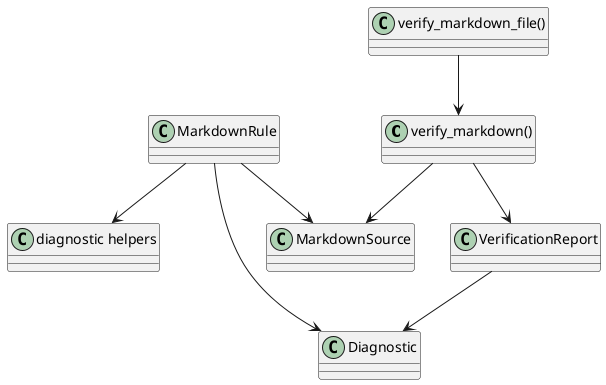
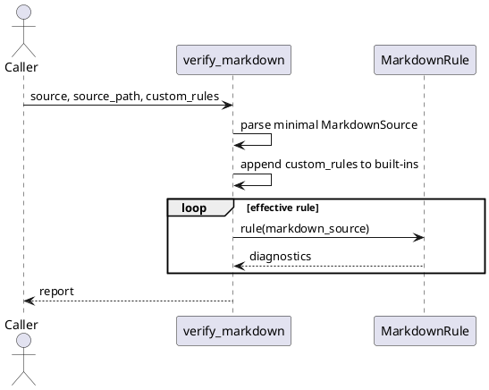

# ADR-001: Markdown Conformance Policy

## Status

Accepted for implementation.

## Context

MkForge separates source verification from document validation. The verification
design must make that boundary explicit:

- verification checks Markdown or GFM conformance;
- verification also checks document resource integrity when local paths can be
  resolved, such as referenced images or local files;
- validation checks project-specific content policies and is out of scope for
  this feature;
- `verify_markdown` is the public entry point;
- the built-in policy applies Markdown and GFM conformance together;
- each conformance rule should live in one auditable rule file;
- simple diagnostic helpers keep repeated scans consistent.

## Decision

Introduce a Markdown conformance policy centered on `verify_markdown`.

`verify_markdown` accepts source text and an optional source path. The function
parses enough source context for built-in checks, runs the merged Markdown/GFM
rules, and returns a simple report.

`verify_markdown_file` is the preferred entry point when rules must resolve
relative resources. A raw string can still be verified, but local image and file
existence checks are skipped when no source path or base directory is available.

Rules stay as plain functions. A rule file may expose one or more closely
related checks, but one diagnostic rule should still have one obvious owner.
Shared diagnostic helpers are plain functions, not an engine.

## Public API

```python
def verify_markdown(
    source: str,
    *,
    source_path: Path | None = None,
    custom_rules: Iterable[MarkdownRule] = (),
) -> VerificationReport:
    ...

def verify_markdown_file(
    path: str | Path,
    *,
    custom_rules: Iterable[MarkdownRule] = (),
) -> VerificationReport:
    ...
```

`VerificationReport` contains:

- `rule_set_name`: name of the built-in conformance rule set;
- `diagnostics`: sorted conformance diagnostics;
- `passed`: `True` when no diagnostics were emitted;
- `custom_rules`: callables appended to the built-in rules for one call.

## Rule Contract

Each rule is a callable with this shape:

```python
type MarkdownRule = Callable[[MarkdownSource], tuple[Diagnostic, ...]]
```

Custom rules use the same callable shape. They are appended after built-in
rules and do not mutate global state.

Rule module requirements:

- the module docstring explains the conformance rule and emitted diagnostic;
- each rule function has a stable diagnostic identifier;
- each rule function returns diagnostics;
- repeated scans use small diagnostic helper functions.

Resource rule requirements:

- resolve relative image and file targets against the Markdown file directory;
- ignore remote URLs such as `https://example.com/image.png`;
- ignore fragment-only references such as `#section`;
- emit a diagnostic when a local referenced target does not exist;
- require `source_path` and return no diagnostics when only raw source text is
  supplied without a base path.

## Design Patterns

Built-in Rule Set:
MkForge merges classic Markdown and GFM checks because callers should not need
to choose between them for normal verification.

Custom Rule Extension:
`custom_rules` provides a lightweight extension point for one-off or
project-local checks without introducing a registry. If custom rule management
becomes persistent or shared across projects, a registry can be added later.

Function Rules:
Rules remain plain callables. This avoids class ceremony while keeping each
diagnostic easy to audit.

## PlantUML

### Structure



### Flow



## Rule File Layout

```text
src/mkforge/verification/
  api.py
  policy.py
  diagnostic_pattern.py
  rules/
    markdown/
      md001_atx_heading_space.py
      md002_closed_atx_heading_space.py
      md003_local_resource_exists.py
    gfm/
      gfm001_table_delimiter.py
      gfm002_table_column_count.py
      gfm003_task_list_marker.py
```

## Non-Goals

- Do not validate document policy, metadata, required headings, wording, or
  project naming conventions.
- Do not implement lint style preferences such as line length or marker style.
- Do not rewrite Markdown.
- Do not add a registry, loader, or engine until the rule set needs it.

## Consequences

Positive:

- `verify_markdown` is small and direct.
- The policy object makes conformance choices explicit.
- Rules stay auditable and can still move one-rule-per-file later.
- The markdownlint compatibility layer intentionally groups the full external
  `RULES.md` matrix in one module so defaults, shared parsing, disabling, and
  documentation remain aligned with one upstream rule table.

Tradeoffs:

- Policy objects may become large if too many profiles are added.
- A registry can be introduced later if manual policy composition becomes
  repetitive.
- The markdownlint aggregate module is larger than the usual 500-line module
  target. The project code-metrics threshold is raised to 900 logical lines for
  this external-spec compatibility module instead of splitting tightly coupled
  rule-table behavior into artificial fragments.
