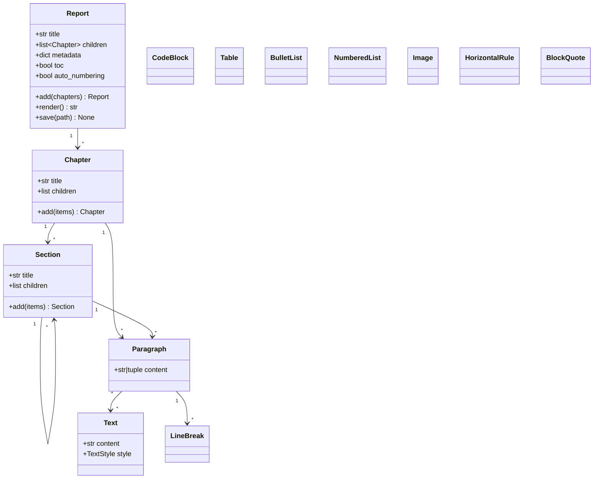
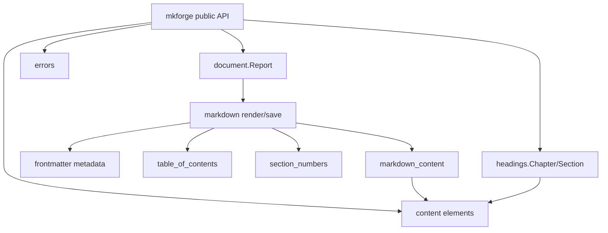
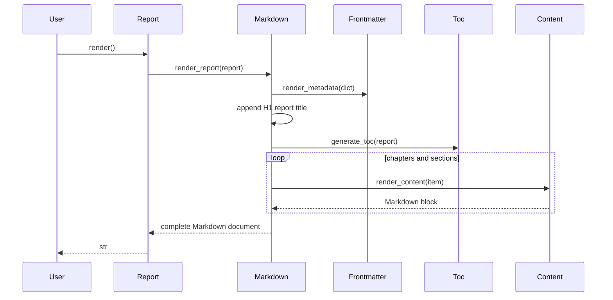
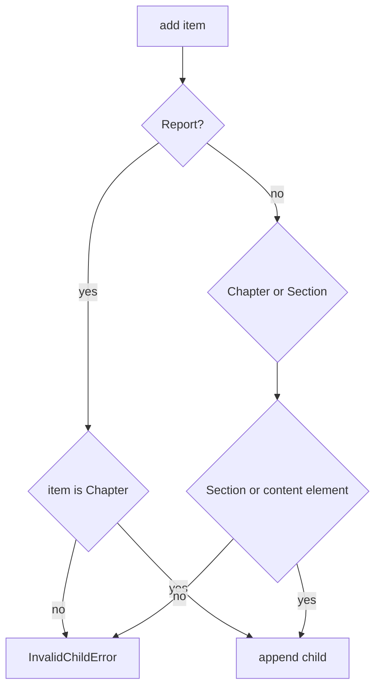

# MkForge API Reference

## 1. Purpose

This reference documents every supported MkForge API surface, including public
classes, public exceptions, module-level helpers, complete examples, and UML
diagrams.

The full runnable demonstration is `demo_report.py`.

## 2. Import Model

Preferred user imports:

```python
from mkforge import Chapter, Paragraph, Report, Section, Table
```

Advanced helper imports:

```python
from mkforge.markdown import render_report, save_report
from mkforge.section_numbers import NumberingContext, numbered_title
from mkforge.table_of_contents import anchor_slug, generate_toc
```

## 3. Complete Minimal Example

```python
from mkforge import Chapter, Paragraph, Report, Section

report = Report(
    title="Release Notes",
    metadata={"title": "Release Notes", "draft": False},
    toc=True,
    auto_numbering=True,
).add(
    Chapter("Summary").add(
        Section("Status").add(
            Paragraph("All checks passed."),
        ),
    ),
)

markdown = report.render()
report.save("work/release-notes.md")
```

Rendered heading hierarchy:

```markdown
# Release Notes

## 1. Summary

### 1.1. Status
```

## 4. Public Classes

### 4.1 `Report`

Module: `mkforge.document`

Exported by: `mkforge`

Signature:

```python
Report(
    title: str,
    children: list[Chapter] = ...,
    metadata: dict[str, object] | None = None,
    toc: bool = False,
    auto_numbering: bool = False,
)
```

Attributes:

| Attribute | Type | Description |
|---|---|---|
| `title` | `str` | document title rendered as the only H1 |
| `children` | `list[Chapter]` | ordered chapters |
| `metadata` | `dict[str, object] | None` | optional frontmatter dictionary |
| `toc` | `bool` | whether to render a table of contents |
| `auto_numbering` | `bool` | whether to number chapters and sections |

Methods:

| Method | Returns | Description |
|---|---|---|
| `add(*items: Chapter)` | `Report` | appends chapters and returns self |
| `render()` | `str` | renders Markdown |
| `save(path)` | `None` | writes Markdown to UTF-8 file |

Raises:

| Condition | Exception |
|---|---|
| blank title | `ValueError` |
| non-chapter passed to `add()` | `InvalidChildError` |

Example:

```python
from mkforge import Chapter, Report

report = Report(
    title="Quality Report",
    metadata={
        "title": "Quality Report",
        "author": "Antoine Barre",
        "tags": ["quality", "automation"],
        "draft": False,
        "reviewed": None,
    },
    toc=True,
    auto_numbering=True,
).add(
    Chapter("Overview"),
)
```

### 4.2 `Chapter`

Module: `mkforge.headings`

Exported by: `mkforge`

Signature:

```python
Chapter(title: str, children: list[Section | ContentElement] = ...)
```

Rendering:

```markdown
## Chapter title
```

Methods:

| Method | Returns | Description |
|---|---|---|
| `add(*items)` | `Chapter` | appends sections or content and returns self |

Raises:

| Condition | Exception |
|---|---|
| blank title | `ValueError` |
| unsupported child | `InvalidChildError` |

Example:

```python
from mkforge import Chapter, Paragraph

chapter = Chapter("Executive Summary").add(
    Paragraph("This report summarizes the release state."),
)
```

### 4.3 `Section`

Module: `mkforge.headings`

Exported by: `mkforge`

Signature:

```python
Section(title: str, children: list[Section | ContentElement] = ...)
```

Rendering:

```markdown
### Direct section
#### Nested section
##### Deeper section
###### Deepest supported section
```

Methods:

| Method | Returns | Description |
|---|---|---|
| `add(*items)` | `Section` | appends nested sections or content and returns self |

Raises:

| Condition | Exception |
|---|---|
| blank title | `ValueError` |
| unsupported child | `InvalidChildError` |
| render below H6 | `ReportDepthError` |

Example:

```python
from mkforge import Paragraph, Section

section = Section("Risks").add(
    Section("Operational").add(
        Paragraph("No blocking operational risk was found."),
    ),
)
```

### 4.4 `Paragraph`

Module: `mkforge.content`

Exported by: `mkforge`

Signature:

```python
Paragraph(content: str | tuple[Text | LineBreak, ...])
```

Raises:

| Condition | Exception |
|---|---|
| `content == ""` for plain string content | `ValueError` |

Examples:

```python
from mkforge import Paragraph

plain = Paragraph("All checks passed.")
```

```python
from mkforge import LineBreak, Paragraph, Text

rich = Paragraph(
    (
        Text("MkForge renders "),
        Text("Markdown", style="bold"),
        Text(" from "),
        Text("Python", style="code"),
        Text("."),
        LineBreak(),
        Text("Inline styles remain explicit."),
    ),
)
```

### 4.5 `Text`

Module: `mkforge.content`

Exported by: `mkforge`

Signature:

```python
Text(content: str, style: TextStyle = "plain")
```

Supported styles:

| Style | Output |
|---|---|
| `plain` | `text` |
| `bold` | `**text**` |
| `italic` | `*text*` |
| `code` | `` `text` `` |
| `strikethrough` | `~~text~~` |

Example:

```python
from mkforge import Text

item = Text("auditable", style="bold")
```

### 4.6 `LineBreak`

Module: `mkforge.content`

Exported by: `mkforge`

Signature:

```python
LineBreak()
```

Rendering:

```markdown
  
```

It is intended for use inside a `Paragraph` inline tuple.

### 4.7 `CodeBlock`

Module: `mkforge.content`

Exported by: `mkforge`

Signature:

```python
CodeBlock(code: str, language: str = "")
```

Example:

```python
from mkforge import CodeBlock

block = CodeBlock("print('hello from mkforge')", language="python")
```

Rendered output:

````markdown
```python
print('hello from mkforge')
```
````

### 4.8 `Table`

Module: `mkforge.content`

Exported by: `mkforge`

Signature:

```python
Table(headers: tuple[str, ...], rows: tuple[tuple[str, ...], ...] = ())
```

Raises:

| Condition | Exception |
|---|---|
| no headers | `InvalidTableError` |
| row width differs from headers | `InvalidTableError` |

Example:

```python
from mkforge import Table

table = Table(
    headers=("Check", "Result"),
    rows=(
        ("format", "pass"),
        ("tests", "pass"),
    ),
)
```

### 4.9 `BulletList`

Module: `mkforge.content`

Exported by: `mkforge`

Signature:

```python
BulletList(items: tuple[str, ...])
```

Raises:

| Condition | Exception |
|---|---|
| no items | `ValueError` |

Example:

```python
from mkforge import BulletList

scope = BulletList(("Markdown output", "Pure Python API"))
```

### 4.10 `NumberedList`

Module: `mkforge.content`

Exported by: `mkforge`

Signature:

```python
NumberedList(items: tuple[str, ...])
```

Raises:

| Condition | Exception |
|---|---|
| no items | `ValueError` |

Example:

```python
from mkforge import NumberedList

steps = NumberedList(("Compose report", "Render Markdown", "Save file"))
```

### 4.11 `Image`

Module: `mkforge.content`

Exported by: `mkforge`

Signature:

```python
Image(path: str, alt: str = "", title: str = "")
```

Example:

```python
from mkforge import Image

image = Image(
    "assets/quality-dashboard.png",
    alt="Quality dashboard",
    title="Release quality",
)
```

Rendered output:

```markdown

```

### 4.12 `HorizontalRule`

Module: `mkforge.content`

Exported by: `mkforge`

Signature:

```python
HorizontalRule()
```

Rendered output:

```markdown
---
```

### 4.13 `BlockQuote`

Module: `mkforge.content`

Exported by: `mkforge`

Signature:

```python
BlockQuote(content: str)
```

Example:

```python
from mkforge import BlockQuote

quote = BlockQuote("Readable reports are easier to review.")
```

Rendered output:

```markdown
> Readable reports are easier to review.
```

## 5. Public Exceptions

### 5.1 `InvalidChildError`

Raised when an unsupported object is added to `Report`, `Chapter`, or
`Section`.

String form:

```text
Report cannot contain Paragraph.
```

### 5.2 `InvalidTableError`

Raised when a `Table` cannot be rendered as a valid GFM table.

### 5.3 `ReportDepthError`

Raised when a nested section would render below H6.

## 6. Module-Level Functions

### 6.1 `mkforge.markdown.render_report`

Signature:

```python
render_report(report: Report) -> str
```

Renders a full Markdown document. Equivalent to `report.render()`.

### 6.2 `mkforge.markdown.save_report`

Signature:

```python
save_report(report: Report, path: str | Path) -> None
```

Writes a full Markdown document to a UTF-8 file. Equivalent to
`report.save(path)`.

### 6.3 `mkforge.table_of_contents.anchor_slug`

Signature:

```python
anchor_slug(title: str) -> str
```

Example:

```python
anchor_slug("Hello, 2026!") == "hello-2026"
```

### 6.4 `mkforge.table_of_contents.generate_toc`

Signature:

```python
generate_toc(report: Report) -> str
```

Generates the TOC list for report chapters and sections.

### 6.5 `mkforge.section_numbers.NumberingContext`

Tracks counters during heading traversal.

Methods:

| Method | Description |
|---|---|
| `enter_level()` | pushes a new zero counter |
| `leave_level()` | pops the active counter |
| `advance()` | increments active counter |
| `prefix()` | returns dotted prefix |

### 6.6 `mkforge.section_numbers.numbered_title`

Signature:

```python
numbered_title(title: str, context: NumberingContext) -> str
```

Returns a title prefixed with the active dotted number.

## 7. Metadata Reference

Metadata is a dictionary. MkForge does not define allowed keys.

Example:

```python
metadata = {
    "title": "Audit",
    "author": "Antoine Barre",
    "tags": ["quality", "markdown"],
    "draft": False,
    "reviewed": None,
}
```

Rendered output:

```markdown
---
title: Audit
author: Antoine Barre
tags:
  - quality
  - markdown
draft: false
reviewed: null
---
```

## 8. UML: Public Object Model



## 9. UML: Module Architecture



## 10. UML: Render Sequence



## 11. UML: Validation Flow



## 12. Complete Demo

Run:

```bash
uv run python demo_report.py
```

The demo writes `work/demo_report.md` and exercises:

- dictionary metadata;
- table of contents;
- automatic numbering;
- report title as the only H1;
- chapters as H2;
- sections as H3 through H6;
- paragraphs and inline styles;
- tables;
- bullet and numbered lists;
- images;
- block quotes;
- horizontal rules;
- code blocks;
- file saving.
