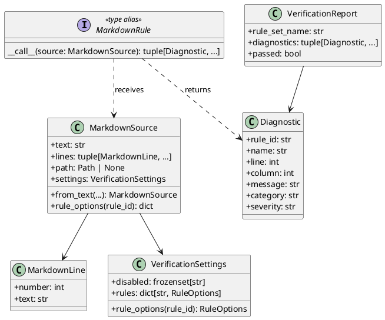
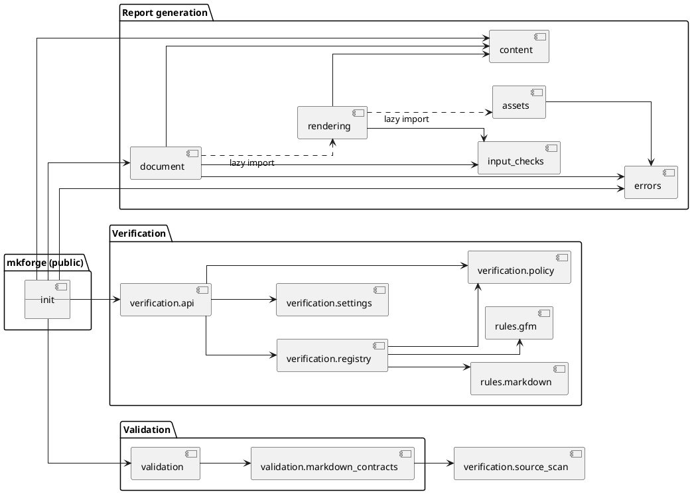
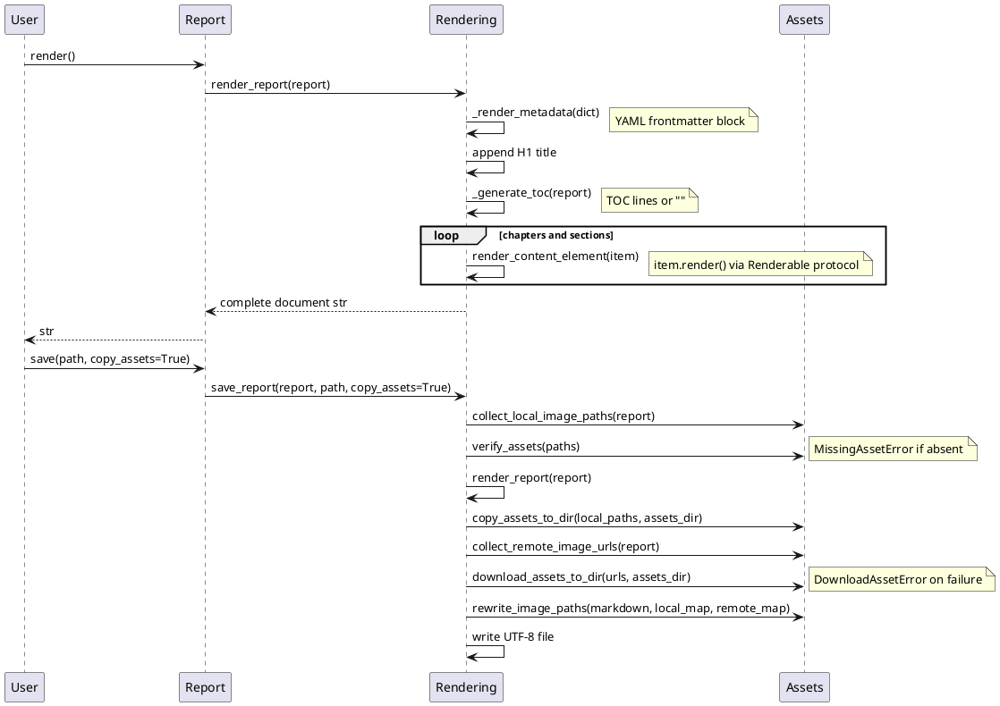
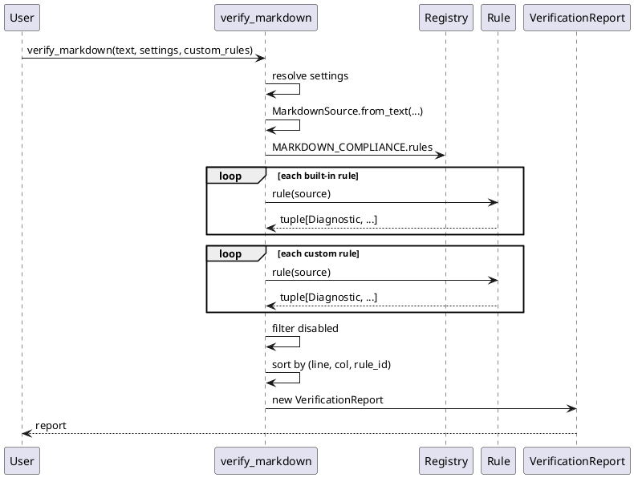
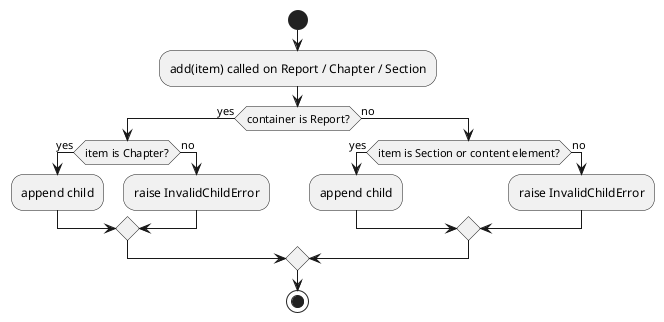
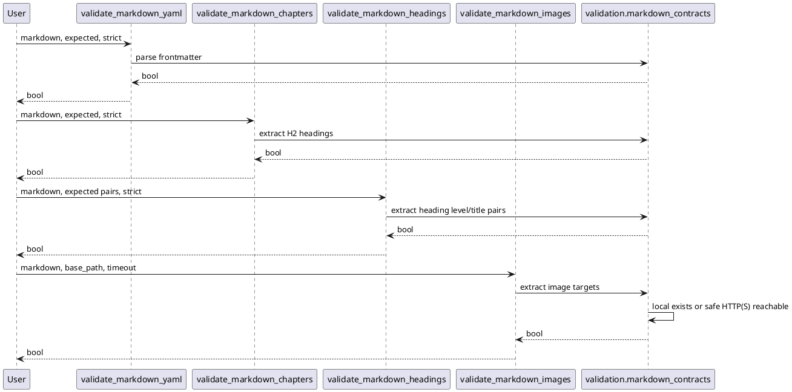

# MkForge API Reference

## 1. Purpose

This reference documents every supported MkForge API surface, including public
classes, public exceptions, module-level helpers, complete examples, and UML
diagrams.

Runnable demonstrations: `demo_report.py` (report generation), `demo_verif.py`
(Markdown verification), and `demo_validation.py` (Markdown validation).

## 2. Import Model

Preferred user imports:

```python
from mkforge import (
    Chapter,
    Link,
    Paragraph,
    Report,
    Section,
    Table,
    validate_markdown_chapters,
    validate_markdown_headings,
    validate_markdown_images,
    validate_markdown_yaml,
    verify_markdown,
    verify_markdown_file,
)
```

Advanced helper imports:

```python
from mkforge.rendering import render_report, save_report, anchor_slug, NumberingContext
from mkforge.document import compute_section_heading_level
```

Verification-specific imports (all re-exported from `mkforge`):

```python
from mkforge import (
    Diagnostic,
    MarkdownLine,
    MarkdownRule,
    MarkdownSource,
    VerificationReport,
    VerificationSettings,
)
```

Validation-specific imports (all re-exported from `mkforge`):

```python
from mkforge import (
    validate_markdown_chapters,
    validate_markdown_headings,
    validate_markdown_images,
    validate_markdown_yaml,
)
```

## 3. Complete Minimal Example

```python
from mkforge import Chapter, Paragraph, Report, Section

report = Report(
    title="Release Notes",
    metadata={"title": "Release Notes", "draft": False},
    toc=True,
    auto_numbering=True,
).add(
    Chapter("Summary").add(
        Section("Status").add(
            Paragraph("All checks passed."),
        ),
    ),
)

markdown = report.render()
report.save("work/release-notes.md")
```

Rendered heading hierarchy:

```markdown
# Release Notes

## 1. Summary

### 1.1. Status
```

---

## 4. Public Classes — Report Generation

### 4.1 `Report`

Module: `mkforge.document`

Exported by: `mkforge`

Signature:

```python
Report(
    title: str,
    children: list[Chapter] = ...,
    metadata: dict[str, object] | None = None,
    toc: bool = False,
    auto_numbering: bool = False,
)
```

Attributes:

| Attribute | Type | Description |
|---|---|---|
| `title` | `str` | Document title rendered as the only H1 |
| `children` | `list[Chapter]` | Ordered chapters |
| `metadata` | `dict[str, object] | None` | Optional frontmatter dictionary |
| `toc` | `bool` | Whether to render a table of contents |
| `auto_numbering` | `bool` | Whether to number chapters and sections |

Methods:

| Method | Returns | Description |
|---|---|---|
| `add(*items: Chapter)` | `Report` | Appends chapters and returns self |
| `render()` | `str` | Renders full Markdown document |
| `save(path, *, copy_assets=False)` | `None` | Writes Markdown to a UTF-8 file; optionally copies images |

`save` parameters:

| Parameter | Type | Default | Description |
|---|---|---|---|
| `path` | `str \| Path` | required | Destination file path |
| `copy_assets` | `bool` | `False` | When `True`, copies local and remote images into `assets/` next to the output file and rewrites image links |

Raises:

| Condition | Exception |
|---|---|
| Blank title | `ValueError` |
| Non-string title | `TypeError` |
| Non-dict metadata | `TypeError` |
| Non-string metadata key | `TypeError` |
| Non-bool `toc` or `auto_numbering` | `TypeError` |
| Invalid initial children collection | `TypeError` |
| Non-chapter passed to `add()` | `InvalidChildError` |
| Local image path does not exist | `MissingAssetError` |
| Remote image download fails (when `copy_assets=True`) | `DownloadAssetError` |

Example:

```python
from mkforge import Chapter, Report

report = Report(
    title="Quality Report",
    metadata={
        "title": "Quality Report",
        "author": "Antoine Barre",
        "tags": ["quality", "automation"],
        "draft": False,
        "reviewed": None,
    },
    toc=True,
    auto_numbering=True,
).add(
    Chapter("Overview"),
)
```

---

### 4.2 `Chapter`

Module: `mkforge.document`

Exported by: `mkforge`

Signature:

```python
Chapter(title: str, children: list[Section | ContentElement] = ...)
```

Rendering:

```markdown
## Chapter title
```

Methods:

| Method | Returns | Description |
|---|---|---|
| `add(*items)` | `Chapter` | Appends sections or content and returns self |

Raises:

| Condition | Exception |
|---|---|
| Blank title | `ValueError` |
| Non-string title | `TypeError` |
| Invalid initial children collection | `TypeError` |
| Unsupported child | `InvalidChildError` |

Example:

```python
from mkforge import Chapter, Paragraph

chapter = Chapter("Executive Summary").add(
    Paragraph("This report summarizes the release state."),
)
```

---

### 4.3 `Section`

Module: `mkforge.document`

Exported by: `mkforge`

Signature:

```python
Section(title: str, children: list[Section | ContentElement] = ...)
```

Rendering (depth-dependent):

```markdown
### Direct section
#### Nested section
##### Deeper section
###### Deepest supported section
```

Methods:

| Method | Returns | Description |
|---|---|---|
| `add(*items)` | `Section` | Appends nested sections or content and returns self |

Raises:

| Condition | Exception |
|---|---|
| Blank title | `ValueError` |
| Non-string title | `TypeError` |
| Invalid initial children collection | `TypeError` |
| Unsupported child | `InvalidChildError` |
| Section rendered below H6 | `ReportDepthError` |

Example:

```python
from mkforge import Paragraph, Section

section = Section("Risks").add(
    Section("Operational").add(
        Paragraph("No blocking operational risk was found."),
    ),
)
```

---

### 4.4 `Paragraph`

Module: `mkforge.content`

Exported by: `mkforge`

Signature:

```python
Paragraph(content: str | tuple[Text | LineBreak | Link, ...])
```

Raises:

| Condition | Exception |
|---|---|
| `content == ""` for plain string content | `ValueError` |
| Non-string and non-tuple content | `TypeError` |
| Tuple item other than `Text`, `LineBreak`, or `Link` | `TypeError` |

Examples:

```python
from mkforge import Paragraph

plain = Paragraph("All checks passed.")
```

```python
from mkforge import LineBreak, Paragraph, Text

rich = Paragraph(
    (
        Text("MkForge renders "),
        Text("Markdown", style="bold"),
        Text(" from "),
        Text("Python", style="code"),
        Text("."),
        LineBreak(),
        Text("Inline styles remain explicit."),
    ),
)
```

---

### 4.5 `Text`

Module: `mkforge.content`

Exported by: `mkforge`

Signature:

```python
Text(content: str, style: TextStyle = "plain")
```

Supported styles:

| Style | Output |
|---|---|
| `plain` | `text` |
| `bold` | `**text**` |
| `italic` | `*text*` |
| `code` | `` `text` `` |
| `strikethrough` | `~~text~~` |

Invalid runtime styles raise `ValueError`.

Example:

```python
from mkforge import Text

item = Text("auditable", style="bold")
```

---

### 4.6 `LineBreak`

Module: `mkforge.content`

Exported by: `mkforge`

Signature:

```python
LineBreak()
```

Rendering:

```markdown
  
```

(Two trailing spaces followed by a newline — Markdown hard line break.)

Intended for use inside a `Paragraph` inline tuple.

---

### 4.7 `Link`

Module: `mkforge.content`

Exported by: `mkforge`

Inline element — valid only inside a `Paragraph` inline tuple.

Signature:

```python
Link(url: str, text: str = "", title: str = "")
```

Parameters:

| Parameter | Type | Default | Description |
|---|---|---|---|
| `url` | `str` | required | Link target URL |
| `text` | `str` | `""` | Link display text; empty renders as `[]` |
| `title` | `str` | `""` | Optional tooltip title |

Rendering:

```markdown
[text](url)
[text](url "title")
```

Example:

```python
from mkforge import Link, Paragraph, Text

para = Paragraph(
    (
        Text("See the "),
        Link("https://example.com", text="documentation", title="Docs"),
        Text(" for details."),
    ),
)
```

---

### 4.8 `CodeBlock`

Module: `mkforge.content`

Exported by: `mkforge`

Signature:

```python
CodeBlock(code: str, language: str = "")
```

Example:

```python
from mkforge import CodeBlock

block = CodeBlock("print('hello from mkforge')", language="python")
```

Rendered output:

````markdown
```python
print('hello from mkforge')
```
````

---

### 4.9 `Table`

Module: `mkforge.content`

Exported by: `mkforge`

Signature:

```python
Table(headers: tuple[str, ...], rows: tuple[tuple[str, ...], ...] = ())
Table.from_columns(columns: Mapping[str, tuple[str, ...]])
```

Raises:

| Condition | Exception |
|---|---|
| No headers | `InvalidTableError` |
| Row width differs from header count | `InvalidTableError` |
| Column lengths differ in `from_columns` | `InvalidTableError` |
| Non-tuple headers or rows | `TypeError` |
| Non-mapping `from_columns` input | `TypeError` |
| Non-tuple column value | `TypeError` |
| Non-string header or cell | `TypeError` |

Example:

```python
from mkforge import Table

table = Table(
    headers=("Check", "Result"),
    rows=(
        ("format", "pass"),
        ("tests", "pass"),
    ),
)
```

Column-oriented construction:

```python
from mkforge import Table

table = Table.from_columns(
    {
        "Check": ("format", "tests"),
        "Result": ("pass", "pass"),
    },
)
```

---

### 4.11 `BulletList`

Module: `mkforge.content`

Exported by: `mkforge`

Signature:

```python
BulletList(items: tuple[str, ...])
```

Raises:

| Condition | Exception |
|---|---|
| No items | `ValueError` |
| Non-tuple items | `TypeError` |
| Non-string item | `TypeError` |

Example:

```python
from mkforge import BulletList

scope = BulletList(("Markdown output", "Pure Python API"))
```

---

### 4.12 `NumberedList`

Module: `mkforge.content`

Exported by: `mkforge`

Signature:

```python
NumberedList(items: tuple[str, ...])
```

Raises:

| Condition | Exception |
|---|---|
| No items | `ValueError` |
| Non-tuple items | `TypeError` |
| Non-string item | `TypeError` |

Example:

```python
from mkforge import NumberedList

steps = NumberedList(("Compose report", "Render Markdown", "Save file"))
```

---

### 4.13 `Image`

Module: `mkforge.content`

Exported by: `mkforge`

Signature:

```python
Image(path: str, alt: str = "", title: str = "")
```

Example:

```python
from mkforge import Image

image = Image(
    "assets/quality-dashboard.png",
    alt="Quality dashboard",
    title="Release quality",
)
```

Rendered output:

```markdown

```

---

### 4.14 `HorizontalRule`

Module: `mkforge.content`

Exported by: `mkforge`

Signature:

```python
HorizontalRule()
```

Rendered output:

```markdown
---
```

---

### 4.15 `BlockQuote`

Module: `mkforge.content`

Exported by: `mkforge`

Signature:

```python
BlockQuote(content: str)
```

Example:

```python
from mkforge import BlockQuote

quote = BlockQuote("Readable reports are easier to review.")
```

Rendered output:

```markdown
> Readable reports are easier to review.
```

---

## 5. Public Exceptions

### 5.1 `InvalidChildError`

Raised when an unsupported object is added to `Report`, `Chapter`, or
`Section`.

String form:

```text
Report cannot contain Paragraph.
```

### 5.2 `InvalidTableError`

Raised when a `Table` cannot be rendered as a valid GFM table.

### 5.3 `ReportDepthError`

Raised when a nested section would render below H6.

### 5.4 `MissingAssetError`

Raised by `save()` / `save_report()` when one or more local image paths do
not exist on disk before writing the output file.

Attributes:

| Attribute | Type | Description |
|---|---|---|
| `missing` | `tuple[Path, ...]` | All missing paths, in the order they were found |

String form:

```text
Missing asset files: /project/chart.png, /project/logo.png
```

### 5.5 `DownloadAssetError`

Raised by `save(copy_assets=True)` / `save_report(copy_assets=True)` when a
remote image URL cannot be downloaded.

Attributes:

| Attribute | Type | Description |
|---|---|---|
| `url` | `str` | The URL that failed |
| `reason` | `str` | The failure reason |

Raised for:
- Unsupported URL schemes (only `http`, `https`, `ftp`, `ftps` are allowed)
- Hostnames that resolve to private or loopback addresses (SSRF protection)
- Network errors (`URLError`)

String form:

```text
Failed to download asset 'https://example.com/img.png': <urlopen error timeout>
```

---

## 6. Module-Level Functions — Report Generation

### 6.1 `mkforge.rendering.render_report`

Signature:

```python
render_report(report: Report) -> str
```

Renders a full Markdown document. Equivalent to `report.render()`.

### 6.2 `mkforge.rendering.save_report`

Signature:

```python
save_report(report: Report, path: str | Path, *, copy_assets: bool = False) -> None
```

Writes a full Markdown document to a UTF-8 file. Equivalent to
`report.save(path, copy_assets=copy_assets)`.

When `copy_assets=True`:

1. Local image files are copied into an `assets/` directory next to `path`.
2. Remote image URLs are downloaded into the same `assets/` directory.
3. All image links in the rendered Markdown are rewritten to `assets/<filename>`.

Filename collisions (two images sharing a basename) are renamed with a `_N`
suffix and a `UserWarning` is emitted.

Raises `MissingAssetError` if any local image is absent.  Raises
`DownloadAssetError` if a remote download fails.

### 6.3 `mkforge.rendering.anchor_slug`

Signature:

```python
anchor_slug(title: str) -> str
```

Converts a heading title to a GitHub-style anchor slug.

Example:

```python
anchor_slug("Hello, 2026!") == "hello-2026"
```

### 6.4 `mkforge.rendering.NumberingContext`

Tracks heading counters during rendering traversal.

Methods:

| Method | Description |
|---|---|
| `enter_level()` | Pushes a new zero counter |
| `leave_level()` | Pops the active counter |
| `advance()` | Increments the active counter |
| `prefix()` | Returns the dotted prefix string (e.g. `1.2.`) |

### 6.5 `mkforge.document.compute_section_heading_level`

Signature:

```python
compute_section_heading_level(depth_from_chapter: int) -> int
```

Returns the Markdown heading level (3–6) for a section at a given nesting
depth below its parent chapter. Raises `ReportDepthError` when the level
would exceed H6.

---

## 7. Metadata Reference

Metadata is a free-form dictionary. MkForge does not define allowed keys.

Example:

```python
metadata = {
    "title": "Audit",
    "author": "Antoine Barre",
    "tags": ["quality", "markdown"],
    "draft": False,
    "reviewed": None,
}
```

Rendered output:

```markdown
---
title: Audit
author: Antoine Barre
tags:
  - quality
  - markdown
draft: false
reviewed: null
---
```

Value rendering rules:

| Python type | Frontmatter output |
|---|---|
| `list` / `tuple` | YAML block list (`- item`) |
| `bool` | `true` or `false` (lowercase) |
| `None` | `null` |
| anything else | `str(value)` |

---

## 8. Verification API

MkForge exposes a focused API for Markdown and GitHub Flavored Markdown
conformance verification. The built-in policy is merged: one call checks
classic Markdown syntax, GFM tables, GFM task list markers, and MkForge local
resource references when a file path is available.

### 8.1 `verify_markdown`

Module: `mkforge.verification.api`

Exported by: `mkforge`

Signature:

```python
verify_markdown(
    source: str,
    *,
    source_path: str | Path | None = None,
    settings: VerificationSettings | None = None,
    custom_rules: Iterable[MarkdownRule] = (),
) -> VerificationReport
```

Parameters:

| Parameter | Type | Default | Description |
|---|---|---|---|
| `source` | `str` | required | Markdown source text |
| `source_path` | `str | Path | None` | `None` | Path used for resource resolution and settings discovery |
| `settings` | `VerificationSettings | None` | `None` | In-memory settings; when absent, settings are discovered from TOML files near `source_path` |
| `custom_rules` | `Iterable[MarkdownRule]` | `()` | Additional rule callables appended after built-in rules |

Returns: `VerificationReport`

Raises: nothing (rule errors are not suppressed; malformed rules may raise
internally).

Example:

```python
from mkforge import verify_markdown

report = verify_markdown("# Title\n\n| A | B |\n| --- | --- |\n")
print(report.passed)       # True
print(report.rule_set_name)  # "markdown-compliance"
```

---

### 8.2 `verify_markdown_file`

Module: `mkforge.verification.api`

Exported by: `mkforge`

Signature:

```python
verify_markdown_file(
    path: str | Path,
    *,
    settings: VerificationSettings | None = None,
    custom_rules: Iterable[MarkdownRule] = (),
) -> VerificationReport
```

Reads the file as UTF-8 and delegates to `verify_markdown`. The file path is
used automatically as `source_path` for resource resolution and settings
discovery.

Raises: `FileNotFoundError` when `path` does not exist.

Example:

```python
from mkforge import verify_markdown_file

report = verify_markdown_file("docs/README.md")
for d in report.diagnostics:
    print(f"[{d.rule_id}] line {d.line}: {d.message}")
```

---

### 8.3 `VerificationReport`

Module: `mkforge.verification.api`

Exported by: `mkforge`

Frozen dataclass.

Attributes:

| Attribute | Type | Description |
|---|---|---|
| `rule_set_name` | `str` | Name of the built-in rule set (`"markdown-compliance"`) |
| `diagnostics` | `tuple[Diagnostic, ...]` | Sorted diagnostics, ordered by `(line, column, rule_id)` |
| `passed` | `bool` | `True` when `diagnostics` is empty |

---

### 8.4 `Diagnostic`

Module: `mkforge.verification.policy`

Exported by: `mkforge`

Frozen dataclass.

Attributes:

| Attribute | Type | Default | Description |
|---|---|---|---|
| `rule_id` | `str` | required | Stable rule identifier |
| `name` | `str` | required | Human-readable rule name |
| `line` | `int` | required | One-based source line |
| `column` | `int` | required | One-based source column |
| `message` | `str` | required | Precise diagnostic message |
| `category` | `str` | `"markdown-conformance"` | Diagnostic category |
| `severity` | `str` | `"warning"` | Diagnostic severity |

Custom rule example:

```python
from mkforge import Diagnostic, MarkdownSource

def check_marker(source: MarkdownSource) -> tuple[Diagnostic, ...]:
    """Report the custom BAD_MARKER token."""
    return tuple(
        Diagnostic(
            rule_id="X001",
            name="Custom marker",
            line=line.number,
            column=line.text.index("BAD_MARKER") + 1,
            message="Remove BAD_MARKER.",
        )
        for line in source.lines
        if "BAD_MARKER" in line.text
    )
```

---

### 8.5 `MarkdownSource`

Module: `mkforge.verification.policy`

Exported by: `mkforge`

Frozen dataclass. Passed as the sole argument to every rule callable.

Attributes:

| Attribute | Type | Description |
|---|---|---|
| `text` | `str` | Full Markdown source text |
| `lines` | `tuple[MarkdownLine, ...]` | Pre-split one-based source lines |
| `path` | `Path | None` | Source path; `None` when verifying raw text |
| `settings` | `VerificationSettings` | Active verification settings |

Class method:

```python
MarkdownSource.from_text(
    text: str,
    *,
    source_path: str | Path | None = None,
    settings: VerificationSettings | None = None,
) -> MarkdownSource
```

Instance method:

```python
source.rule_options(rule_id: str) -> dict[str, object]
```

Returns the configured option mapping for a given rule identifier.

---

### 8.6 `MarkdownLine`

Module: `mkforge.verification.policy`

Exported by: `mkforge`

Frozen dataclass.

Attributes:

| Attribute | Type | Description |
|---|---|---|
| `number` | `int` | One-based line number |
| `text` | `str` | Raw line text without trailing newline |

---

### 8.7 `MarkdownRule`

Module: `mkforge.verification.policy`

Exported by: `mkforge`

Type alias:

```python
type MarkdownRule = Callable[[MarkdownSource], tuple[Diagnostic, ...]]
```

Any callable with this signature is a valid rule. Built-in rules and custom
rules are structurally identical.

---

### 8.8 `VerificationSettings`

Module: `mkforge.verification.settings`

Exported by: `mkforge`

Frozen dataclass.

Signature:

```python
VerificationSettings(
    disabled: frozenset[str] = frozenset(),
    rules: dict[str, RuleOptions] = ...,
)
```

Attributes:

| Attribute | Type | Description |
|---|---|---|
| `disabled` | `frozenset[str]` | Rule identifiers to skip |
| `rules` | `dict[str, RuleOptions]` | Per-rule option mappings |

Method:

```python
settings.rule_options(rule_id: str) -> dict[str, object]
```

Examples:

```python
from mkforge import VerificationSettings, verify_markdown

# Disable a rule
report = verify_markdown(
    "# Title\n\n\n",
    settings=VerificationSettings(disabled=frozenset({"MKF001"})),
)
```

```python
# Override rule options
report = verify_markdown(
    "# Title\n\nThis line is quite long.\n",
    settings=VerificationSettings(
        rules={"MD013": {"line_length": 40}},
    ),
)
```

---

## 8.9 Validation API

Module: `mkforge.validation`

Exported by: `mkforge`

Validation functions return booleans for project-specific document contracts.
They do not emit Markdown/GFM compliance diagnostics.

```python
validate_markdown_yaml(
    markdown: str,
    expected: Mapping[str, object],
    *,
    strict: bool = False,
) -> bool
```

Checks YAML frontmatter.  In non-strict mode, the document may contain extra
frontmatter keys.  In strict mode, the keys must exactly match.  Expected
values are checked by type and value; expected Python types such as `bool`
check only the parsed value type.

```python
validate_markdown_chapters(
    markdown: str,
    expected: Iterable[str],
    *,
    strict: bool = False,
) -> bool
```

Checks H2 chapter titles in order.  In non-strict mode, expected chapters must
appear as an ordered subsequence.  In strict mode, the H2 chapter sequence must
match exactly.

```python
validate_markdown_headings(
    markdown: str,
    expected: Iterable[tuple[int, str]],
    *,
    strict: bool = False,
) -> bool
```

Checks heading levels and titles in order. Expected headings are `(level,
title)` pairs such as `(2, "Context")` for `## Context` or `(3, "Scope")` for
`### Scope`. In non-strict mode, expected headings must appear as an ordered
subsequence. In strict mode, the complete heading sequence must match exactly.

```python
validate_markdown_images(
    markdown: str,
    *,
    base_path: str | Path | None = None,
    timeout: float = 5.0,
) -> bool
```

Checks every Markdown image target outside fenced code blocks.  Local paths are
resolved relative to `base_path` when provided, or the current directory when
omitted.  Remote HTTP(S) images are checked with a HEAD request and fallback
GET request.

Example:

```python
from mkforge import (
    validate_markdown_chapters,
    validate_markdown_headings,
    validate_markdown_images,
    validate_markdown_yaml,
)

markdown = """---
title: Release
draft: false
---

# Release

## Context

### Scope


"""

ok = (
    validate_markdown_yaml(markdown, {"draft": False})
    and validate_markdown_chapters(markdown, ("Context",))
    and validate_markdown_headings(markdown, ((2, "Context"), (3, "Scope")))
    and validate_markdown_images(markdown, base_path="doc/release.md")
)
```

---

## 9. Built-in Rule Reference

### 9.1 Rule Identifier Prefixes

| Prefix | Scope |
|---|---|
| `MD001`–`MD047` | markdownlint-compatible Markdown conformance checks |
| `GFM001`–`GFM003` | GitHub Flavored Markdown verification |
| `MKF001` | MkForge resource verification |

### 9.2 Markdown Rules (MD prefix)

| Rule ID | Name | Description |
|---|---|---|
| `MD001` | Heading increment | Heading levels must increment by one at a time |
| `MD002` | First heading level | First heading must be the configured level |
| `MD003` | Heading style | All headings must use a consistent style |
| `MD004` | Unordered list style | Unordered list markers must be consistent |
| `MD005` | List indentation consistency | List indentation must be consistent |
| `MD006` | Top-level list indentation | Top-level unordered lists must not be indented |
| `MD007` | Unordered list indentation | Unordered list indentation must match configured value |
| `MD009` | Trailing spaces | Lines must not have unnecessary trailing spaces |
| `MD010` | Hard tabs | Lines must not contain hard tab characters |
| `MD011` | Reversed link syntax | Links must use `[text](url)` not `(text)[url]` |
| `MD012` | Multiple blank lines | No more than one consecutive blank line |
| `MD013` | Line length | Lines must not exceed the configured length |
| `MD014` | Command prompt | Shell prompt markers unnecessary in command-only blocks |
| `MD018` | ATX heading spacing | ATX headings require a space after `#` |
| `MD019` | ATX heading extra spaces | ATX headings must not have multiple spaces after `#` |
| `MD020` | Closed ATX spacing | Closed ATX headings require a space before closing `#` |
| `MD021` | Closed ATX extra spaces | Closed ATX headings must not have multiple spaces inside |
| `MD022` | Heading blank lines | Headings must be surrounded by blank lines |
| `MD023` | Heading alignment | Headings must start at the beginning of the line |
| `MD024` | Duplicate headings | Headings must not have duplicate content |
| `MD025` | Multiple top-level headings | Only one H1 heading allowed |
| `MD026` | Heading punctuation | Headings must not end with punctuation |
| `MD027` | Blockquote spacing | Blockquote markers must have one space after `>` |
| `MD028` | Blank blockquote line | No blank lines inside a blockquote |
| `MD029` | Ordered list prefix | Ordered list items must use the configured prefix style |
| `MD030` | List marker spacing | Spaces after list markers must match configured value |
| `MD031` | Fence blank lines | Fenced code blocks must be surrounded by blank lines |
| `MD032` | List blank lines | Lists must be surrounded by blank lines |
| `MD033` | Inline HTML | Inline HTML is not allowed (except configured elements) |
| `MD034` | Bare URL | URLs must not appear bare; wrap in `<url>` or `[text](url)` |
| `MD035` | Horizontal rule style | Horizontal rules must use a consistent style |
| `MD036` | Emphasis as heading | Emphasis must not be used as a heading substitute |
| `MD037` | Emphasis marker spacing | No spaces inside emphasis markers |
| `MD038` | Code span spacing | No spaces inside code span markers |
| `MD039` | Link text spacing | No spaces inside link text brackets |
| `MD040` | Fence language | Fenced code blocks must specify a language |
| `MD041` | First line heading | First line must be a heading |
| `MD046` | Code block style | Code blocks must use the configured style |
| `MD047` | Single trailing newline | Files must end with exactly one newline |

### 9.3 GFM Rules (GFM prefix)

| Rule ID | Name | Description |
|---|---|---|
| `GFM001` | GFM table delimiter | Each delimiter cell must have at least three hyphens |
| `GFM002` | GFM table column count | Table rows must have the same column count as the header |
| `GFM003` | GFM task list marker | Task list markers must be `[ ]` or `[x]` |

### 9.4 MkForge Rules (MKF prefix)

| Rule ID | Name | Description |
|---|---|---|
| `MKF001` | Local resource exists | Relative link and image targets must resolve from the source file directory |

`MKF001` is only active when `source_path` is provided. Fragment-only links
(`#anchor`) and remote URLs are not checked.

### 9.5 Configurable Rule Options

| Rule ID | Option | Default | Description |
|---|---|---|---|
| `MD002` | `level` | `1` | Expected first heading level |
| `MD003` | `style` | `"consistent"` | `atx`, `atx_closed`, `setext`, `setext_with_atx`, `consistent` |
| `MD004` | `style` | `"consistent"` | `asterisk`, `plus`, `dash`, `consistent` |
| `MD007` | `indent` | `3` | Spaces per unordered list indent level |
| `MD009` | `br_spaces` | `2` | Trailing spaces allowed for hard line break |
| `MD010` | `ignore_code_blocks` | `False` | Skip hard tab check inside fenced code |
| `MD013` | `line_length` | `80` | Maximum line character count |
| `MD013` | `ignore_code_blocks` | `False` | Skip line length inside fenced code |
| `MD013` | `tables` | `True` | Enforce line length in tables |
| `MD013` | `headings` | `True` | Enforce line length in headings |
| `MD024` | `allow_different_nesting` | `False` | Allow same text at different heading levels |
| `MD025` | `level` | `1` | Heading level considered top-level |
| `MD026` | `punctuation` | `".,;:!?"` | Characters that must not end a heading |
| `MD029` | `style` | `"one"` | `one`, `ordered`, `zero` |
| `MD030` | `ul_single` | `1` | Spaces after unordered marker, single-line item |
| `MD030` | `ol_single` | `1` | Spaces after ordered marker, single-line item |
| `MD030` | `ul_multi` | `1` | Spaces after unordered marker, multi-line item |
| `MD030` | `ol_multi` | `1` | Spaces after ordered marker, multi-line item |
| `MD033` | `allowed_elements` | `""` | Comma-separated HTML element names that are permitted |
| `MD035` | `style` | `"consistent"` | `---`, `***`, `___`, `consistent` |
| `MD036` | `punctuation` | `".,;:!?"` | Trailing characters that identify emphasis-as-heading |
| `MD041` | `level` | `1` | Required level of the first-line heading |
| `MD046` | `style` | `"fenced"` | `fenced`, `indented`, `consistent` |

---

## 10. Settings Configuration

Settings are discovered automatically when `source_path` is provided. MkForge
searches from the source file directory upward for the first directory
containing any of:

1. `pyproject.toml` — read from `[tool.mkforge.verification]`
2. `.mkforge.toml` — read from `[verification]` or root table
3. `.mkforge` — read from `[verification]` or root table

Example `pyproject.toml`:

```toml
[tool.mkforge.verification]
disabled = ["MD013", "MD033"]

[tool.mkforge.verification.rules.MD003]
style = "atx"

[tool.mkforge.verification.rules.MD013]
line_length = 100
headings = false
```

Example `.mkforge.toml`:

```toml
[verification]
disabled = ["MD002"]

[verification.rules.MD004]
style = "dash"
```

Merge semantics: per-rule options are merged key-by-key over defaults; the
`disabled` set is unioned.

---

## 11. Custom Rules

A custom rule is any callable with the `MarkdownRule` signature:

```python
type MarkdownRule = Callable[[MarkdownSource], tuple[Diagnostic, ...]]
```

Custom rules are appended after built-in rules and run in the order given.
They receive the same `MarkdownSource` context and may use `source.lines`,
`source.text`, `source.path`, and `source.rule_options()`.

Full custom rule example:

```python
from mkforge import (
    Diagnostic,
    MarkdownRule,
    MarkdownSource,
    verify_markdown,
)


def check_todo(source: MarkdownSource) -> tuple[Diagnostic, ...]:
    """Return diagnostics for unresolved TODO markers."""
    return tuple(
        Diagnostic(
            rule_id="TEAM001",
            name="Unresolved TODO",
            line=line.number,
            column=line.text.index("TODO:") + 1,
            message="Resolve or remove this TODO before publishing.",
        )
        for line in source.lines
        if "TODO:" in line.text
    )


rules: tuple[MarkdownRule, ...] = (check_todo,)

report = verify_markdown(
    "# Title\n\nTODO: finish this section\n",
    custom_rules=rules,
)
```

---

## 12. UML: Public Object Model

```plantuml
@startuml public-object-model
skinparam classAttributeIconSize 0

class Report {
  +title: str
  +children: list[Chapter]
  +metadata: dict | None
  +toc: bool
  +auto_numbering: bool
  +add(*chapters): Report
  +render(): str
  +save(path): None
}

class Chapter {
  +title: str
  +children: list
  +add(*items): Chapter
}

class Section {
  +title: str
  +children: list
  +add(*items): Section
}

class Paragraph { +content: str | tuple }
class Text { +content: str; +style: TextStyle }
class LineBreak
class Link { +url: str; +text: str; +title: str }
class CodeBlock { +code: str; +language: str }
class Table { +headers: tuple; +rows: tuple }
class BulletList { +items: tuple }
class NumberedList { +items: tuple }
class Image { +path: str; +alt: str; +title: str }
class HorizontalRule
class BlockQuote { +content: str }

Report "1" --> "*" Chapter
Chapter "1" --> "*" Section
Chapter "1" --> "*" Paragraph
Chapter "1" --> "*" CodeBlock
Chapter "1" --> "*" Table
Chapter "1" --> "*" BulletList
Chapter "1" --> "*" NumberedList
Chapter "1" --> "*" Image
Chapter "1" --> "*" HorizontalRule
Chapter "1" --> "*" BlockQuote
Section "1" --> "*" Section
Section "1" --> "*" Paragraph
Section "1" --> "*" CodeBlock
Section "1" --> "*" Table
Section "1" --> "*" BulletList
Section "1" --> "*" NumberedList
Section "1" --> "*" Image
Section "1" --> "*" HorizontalRule
Section "1" --> "*" BlockQuote
Paragraph "1" --> "*" Text
Paragraph "1" --> "*" LineBreak
Paragraph "1" --> "*" Link
@enduml
```

## 13. UML: Verification Type Model



## 14. UML: Module Architecture



## 15. UML: Render Sequence



## 16. UML: Verification Sequence



## 17. UML: Validation Flow



### 17.1 UML: Markdown Validation Sequence



## 18. Complete Demos

### Report generation

```bash
uv run python demo_report.py
```

Exercises: dictionary metadata, TOC, automatic numbering, H1–H6 headings,
paragraphs and inline styles, tables, bullet and numbered lists, images,
block quotes, horizontal rules, code blocks, file saving.

### Verification

```bash
uv run python demo_verif.py
```

Exercises: clean GFM source, mixed conformance violations, markdownlint-derived
rules, file verification with resource checks, custom rules, disabled rules,
rule option overrides, multiple custom rules, virtual `source_path`.

### Validation

```bash
uv run python demo_validation.py
```

Exercises: YAML frontmatter contracts, strict and minimum matching, H2 chapter
order checks, heading level/title checks, local image existence, remote HTTP(S)
image checks, and a combined boolean validation gate.
