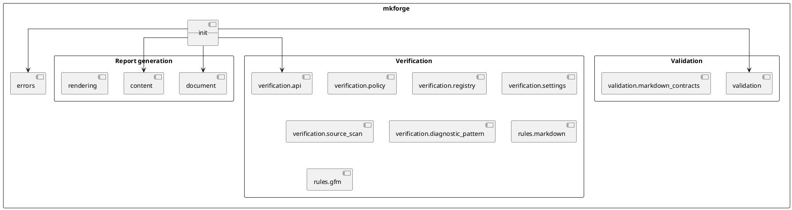
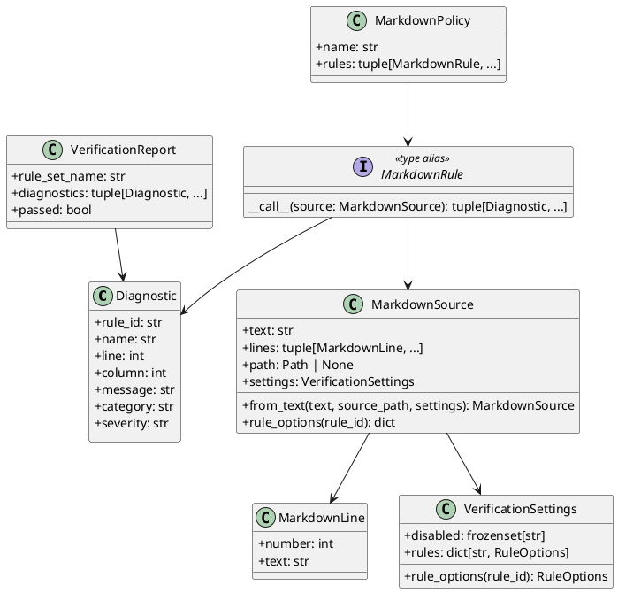
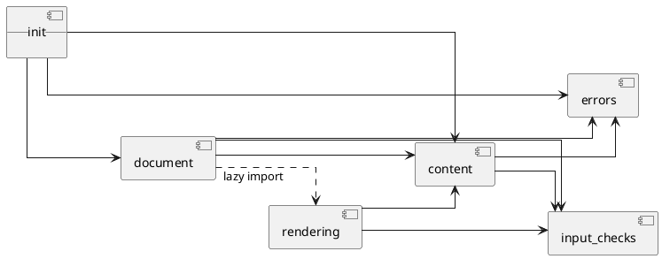
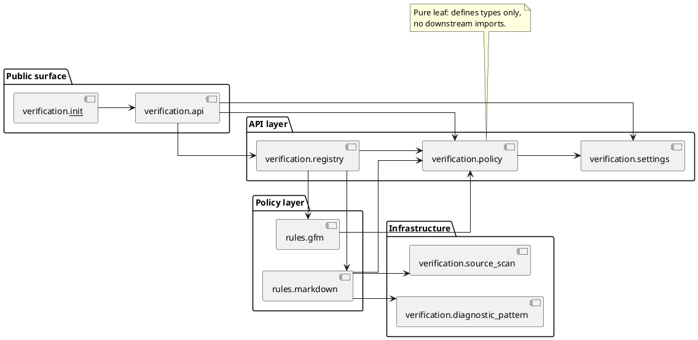
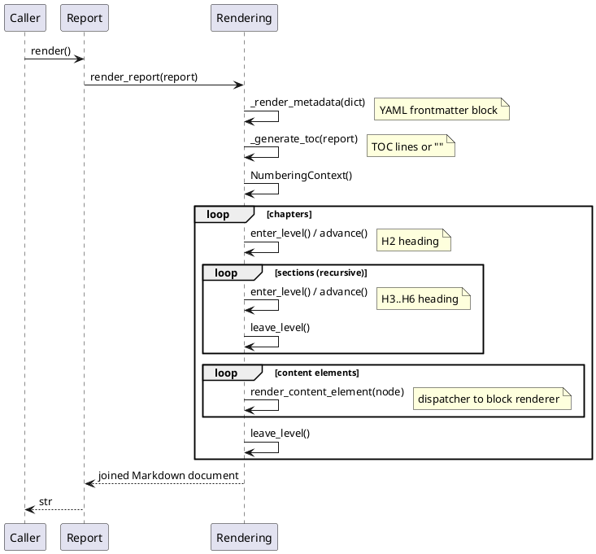
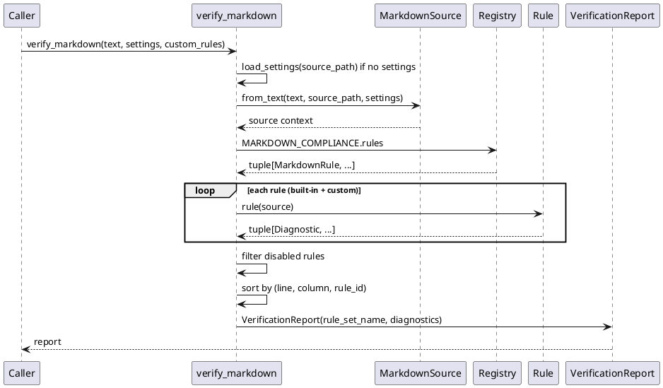
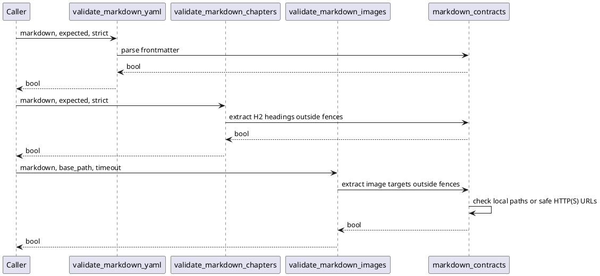
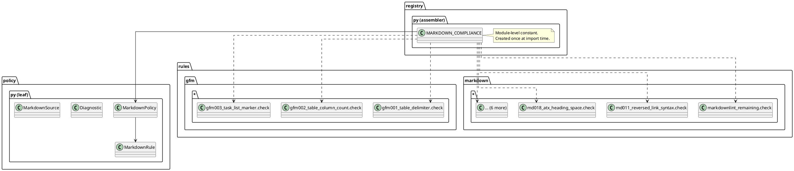
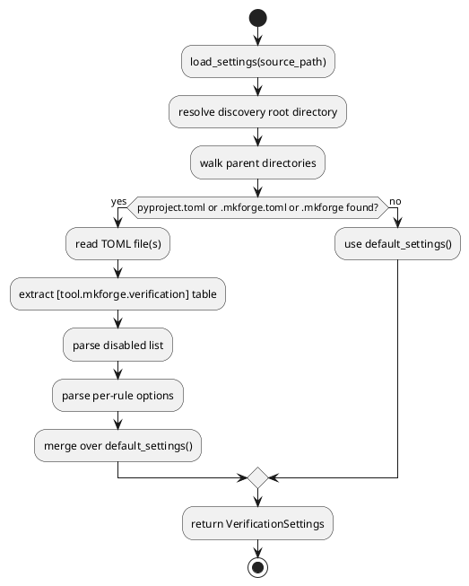

# Software Design Description

## 1. Identification

Document ID: `MKF-SDD-001`

Product: MkForge

Version: 0.1.0

Status: Baseline design description

Related requirements: `docs/SRS.md`

## 2. Purpose

This Software Design Description explains how MkForge satisfies the SRS. It is
written for implementation review, maintenance, audit, and qualification
evidence.

## 3. Design Goals

| ID | Goal |
|---|---|
| DSG-001 | Keep the public API narrow and explicit. |
| DSG-002 | Keep runtime dependencies limited to the standard library. |
| DSG-003 | Separate report data from Markdown rendering. |
| DSG-004 | Validate inputs close to object construction or composition. |
| DSG-005 | Keep Markdown output deterministic. |
| DSG-006 | Keep functions small enough for repository quality gates. |
| DSG-007 | Keep verification orthogonal to report generation. |
| DSG-008 | Make each conformance rule independently auditable. |
| DSG-009 | Keep project-specific validation orthogonal to Markdown conformance verification. |

## 4. Architecture Overview

MkForge is organized as three independent subsystems sharing the same package
namespace:

**Report generation subsystem** — builds and renders structured Markdown
documents from Python objects.

**Verification subsystem** — checks Markdown source text against Markdown,
GFM, and MkForge-specific conformance rules.

**Validation subsystem** — checks project-specific Markdown contracts such as
required YAML frontmatter, ordered chapters, and reachable image targets.

Each subsystem has its own entry points, data types, and internal module graph.
They share no mutable state.



No module starts external processes or depends on third-party runtime
libraries. Remote image validation may perform bounded HTTP(S) requests after
scheme and host safety checks.

## 5. Module Responsibilities

### 5.1 Report Generation Modules

| Module | Responsibility | Public Elements |
|---|---|---|
| `mkforge.__init__` | Stable package exports | public API names |
| `mkforge._metadata` | Package identity constants | `PROJECT_NAME`, `PROJECT_DESCRIPTION` |
| `mkforge.content` | Content element dataclasses and their construction-time validation | `Paragraph`, `Text`, `LineBreak`, `Link`, `CodeBlock`, `Table`, `BulletList`, `NumberedList`, `Image`, `HorizontalRule`, `BlockQuote` |
| `mkforge.document` | Report, Chapter, Section containers and heading depth | `Report`, `Chapter`, `Section`, `compute_section_heading_level` |
| `mkforge.rendering` | Complete Markdown rendering pipeline: frontmatter, TOC, numbering, content dispatch, and save orchestration | `render_report`, `save_report`, `anchor_slug`, `NumberingContext` |
| `mkforge.assets` | Asset collection, verification, copy, download, and path rewriting at save time | `collect_local_image_paths`, `collect_remote_image_urls`, `verify_assets`, `copy_assets_to_dir`, `download_assets_to_dir`, `rewrite_image_paths` |
| `mkforge.errors` | Explicit package exceptions | `InvalidChildError`, `InvalidTableError`, `ReportDepthError`, `MissingAssetError`, `DownloadAssetError` |
| `mkforge.input_checks` | Shared primitive input validation guards | `require_string`, `require_bool`, `require_tuple`, `require_path`, `require_metadata` |

### 5.2 Verification Modules

| Module | Responsibility |
|---|---|
| `mkforge.verification` | Public verification API re-exports |
| `mkforge.verification.api` | `verify_markdown`, `verify_markdown_file`, `VerificationReport` |
| `mkforge.verification.policy` | Core types: `Diagnostic`, `MarkdownLine`, `MarkdownSource`, `MarkdownRule`, `MarkdownPolicy` |
| `mkforge.verification.registry` | Policy assembly: builds `MARKDOWN_COMPLIANCE` from rule modules |
| `mkforge.verification.settings` | `VerificationSettings`, TOML discovery and merge |
| `mkforge.verification.source_scan` | `lines_outside_fenced_code` scanning helper |
| `mkforge.verification.diagnostic_pattern` | `matching_lines` regex-based diagnostic helper |
| `mkforge.verification.rules.markdown._shared` | Shared parsers and diagnostic helpers for MD rules |
| `mkforge.verification.rules.markdown.markdownlint_remaining` | Compatibility facade aggregating MD001–MD047 rule modules |
| `mkforge.verification.rules.gfm.*` | GFM001–GFM003 rules (one module each) |
| `mkforge.verification.rules.markdown.md*` | Individual MD rule modules (one module per rule or cohesive group) |
| `mkforge.verification.rules.markdown.mkf001_local_resource_exists` | MKF001 local resource resolution |

### 5.3 Validation Modules

| Module | Responsibility |
|---|---|
| `mkforge.validation` | Public validation API re-exports |
| `mkforge.validation.markdown_contracts` | Boolean validation helpers for YAML frontmatter contracts, H2 chapter order, and local or remote image existence |

## 6. Static Structure — Report Generation

```plantuml
@startuml report-class-diagram
skinparam classAttributeIconSize 0

class Report {
  +title: str
  +children: list[Chapter]
  +metadata: dict | None
  +toc: bool
  +auto_numbering: bool
  +add(*items: Chapter): Report
  +render(): str
  +save(path, *, copy_assets=False): None
}

class Chapter {
  +title: str
  +children: list
  +add(*items): Chapter
}

class Section {
  +title: str
  +children: list
  +add(*items): Section
}

class Paragraph {
  +content: str | tuple
}
class Text {
  +content: str
  +style: TextStyle
}
class LineBreak
class Link {
  +url: str
  +text: str
  +title: str
}
class CodeBlock {
  +code: str
  +language: str
}
class Table {
  +headers: tuple[str, ...]
  +rows: tuple[tuple[str, ...], ...]
  +from_columns(columns) Table
}
class BulletList { +items: tuple[str, ...] }
class NumberedList { +items: tuple[str, ...] }
class Image {
  +path: str
  +alt: str
  +title: str
}
class HorizontalRule
class BlockQuote { +content: str }

Report "1" --> "*" Chapter
Chapter "1" --> "*" Section
Chapter "1" --> "*" Paragraph
Chapter "1" --> "*" CodeBlock
Chapter "1" --> "*" Table
Chapter "1" --> "*" BulletList
Chapter "1" --> "*" NumberedList
Chapter "1" --> "*" Image
Chapter "1" --> "*" HorizontalRule
Chapter "1" --> "*" BlockQuote
Section "1" --> "*" Section
Section "1" --> "*" Paragraph
Section "1" --> "*" CodeBlock
Section "1" --> "*" Table
Section "1" --> "*" BulletList
Section "1" --> "*" NumberedList
Section "1" --> "*" Image
Section "1" --> "*" HorizontalRule
Section "1" --> "*" BlockQuote
Paragraph "1" --> "*" Text
Paragraph "1" --> "*" LineBreak
Paragraph "1" --> "*" Link
@enduml
```

## 7. Static Structure — Verification Subsystem



## 8. Module Dependency Diagram — Report Generation



## 9. Module Dependency Diagram — Verification Subsystem



## 10. Runtime Rendering Sequence



## 11. Runtime Verification Sequence



### 11.1 Runtime Validation Sequence



## 12. Registry Pattern — Rule Assembly

The `registry.py` module is the single coupling point between the policy type
system and concrete rule implementations. This isolates `policy.py` as a pure
type leaf with no downstream imports.



## 13. Rule Module Structure

Each rule is an autonomous module exporting a single `check` callable. The
`_shared.py` helper module centralizes document model types and parsing helpers
reused across rules.

```plantuml
@startuml rule-structure
skinparam linetype ortho

package "_shared.py" {
  class _Heading { line; level; text; style }
  class _ListItem { line; indent; marker; gap; ordered }
  class _CodeBlock { start; end; info; lines }
  note as N1
    Scanning: _headings(), _list_items(),
    _fenced_blocks(), _unordered_items(),
    _ordered_items()
    Helpers: _diagnostic(), _int_option(),
    _code_filtered_lines(), _line_is_too_long(),
    _blank_line_diagnostics(), _allowed_html(), ...
  end note
}

package "Individual rule modules" {
  class "md001_heading_increment" as R1 { check(source) }
  class "md003_heading_style" as R3 { check(source) }
  class "md013_line_length" as R13 { check(source) }
  class "md040_md041_md046_md047_blocks" as R40 {
    check(source)
    first_line_heading(source)
    code_block_style(source)
  }
  class "... (17 more modules)" as RN { check(source) }
}

package "markdownlint_remaining.py (facade)" {
  class "check(source)" as Facade
  note right
    Aggregates all MD rule modules.
    Re-exports private helpers for
    backward-compatible test access.
  end note
}

R1 --> _shared.py
R3 --> _shared.py
R13 --> _shared.py
R40 --> _shared.py
Facade --> R1
Facade --> R3
Facade --> R13
Facade --> R40
Facade --> RN
@enduml
```

## 14. Settings Discovery and Merge



Default rule options are markdownlint-compatible. Users override them via:

- `pyproject.toml` under `[tool.mkforge.verification]`
- `.mkforge.toml` at any ancestor directory
- `.mkforge` at any ancestor directory

Merge semantics: per-rule keys are merged individually; the `disabled` set is
unioned.

## 15. Data Design

### 15.1 Report

`Report` stores the document title, ordered chapters, optional metadata
dictionary, TOC flag, and automatic numbering flag.

Design decisions:

- `Report` is mutable through `add()` to support fluent composition.
- `Report.render()` delegates to `mkforge.rendering.render_report`.
- `Report.save(path)` delegates to `mkforge.rendering.save_report`.
- Metadata remains a free-form dictionary.
- Metadata type, metadata keys, TOC flag, numbering flag, and initial children
  are validated during construction.

### 15.2 Chapter

`Chapter` stores a non-blank title and ordered child items. It renders as H2.

Allowed children: `Section`, and any content element defined in
`mkforge.content`.

### 15.3 Section

`Section` stores a non-blank title and ordered child items. It renders as H3
through H6 depending on depth.

Allowed children: nested `Section`, and any content element defined in
`mkforge.content`.

### 15.4 Content Elements

Content elements are dataclasses representing Markdown concepts. Most are
frozen because they are value-like and do not need composition methods.

| Class | Stored Data | Validation | Scope |
|---|---|---|---|
| `Text` | `content`, `style` | style literal enforced at construction | inline |
| `LineBreak` | none | none | inline |
| `Link` | `url`, `text`, `title` | none | inline (inside `Paragraph` only) |
| `Paragraph` | plain string or inline tuple | empty plain string rejected; inline items must be `Text`, `LineBreak`, or `Link` | block |
| `CodeBlock` | code, language | none | block |
| `Table` | headers, rows | headers required, row width checked; `from_columns` checks column lengths | block |
| `BulletList` | items | non-empty | block |
| `NumberedList` | items | non-empty | block |
| `Image` | path, alt, title | none | block |
| `HorizontalRule` | none | none | block |
| `BlockQuote` | content | none | block |

### 15.5 Diagnostic

`Diagnostic` is an immutable frozen dataclass. Fields:

| Field | Type | Default | Description |
|---|---|---|---|
| `rule_id` | `str` | required | Stable rule identifier (`MD013`, `GFM001`, `MKF001`) |
| `name` | `str` | required | Human-readable rule name |
| `line` | `int` | required | One-based source line number |
| `column` | `int` | required | One-based source column number |
| `message` | `str` | required | Precise diagnostic message |
| `category` | `str` | `"markdown-conformance"` | Diagnostic category |
| `severity` | `str` | `"warning"` | Diagnostic severity |

### 15.6 MarkdownSource

`MarkdownSource` is a frozen dataclass carrying all context needed by any rule.
Rules receive it as their sole argument. This isolates rules from call-site
concerns (file I/O, settings loading) and makes rules trivially testable.

| Field | Type | Description |
|---|---|---|
| `text` | `str` | Full Markdown source text |
| `lines` | `tuple[MarkdownLine, ...]` | Pre-split, one-based indexed lines |
| `path` | `Path | None` | Source path for local resource resolution |
| `settings` | `VerificationSettings` | Rule options and disabled set |

### 15.7 MarkdownPolicy

`MarkdownPolicy` pairs a name with an ordered tuple of `MarkdownRule`
callables. The policy is immutable and assembled once in `registry.py` at
module import time.

## 16. Markdown Heading Design

The report title is the only H1:

```markdown
# Report title
```

Chapters render as H2:

```markdown
## Chapter title
```

Direct sections render as H3:

```markdown
### Section title
```

Nested sections increment heading level until H6. Rendering a section deeper
than H6 raises `ReportDepthError`.

## 17. Rendering Algorithms

### 17.1 Report Rendering

1. Create a list of Markdown blocks.
2. If metadata exists, append rendered frontmatter.
3. Append the H1 report title.
4. If TOC is enabled, append generated TOC when not empty.
5. Traverse chapters in order.
6. Traverse nested sections in order.
7. Render content elements through `rendering.render_content_element`.
8. Join blocks with two newlines.

### 17.2 Frontmatter Rendering

For each metadata dictionary item:

- `list` and `tuple` values render as YAML list blocks;
- `bool` values render lowercase;
- `None` renders as `null`;
- all other values render through `str(value)`.

The frontmatter renderer inside `rendering.py` is deliberately small, not a complete YAML
serializer.

### 17.3 TOC Rendering

The TOC traverses chapters and sections. Each line uses:

- two spaces per nesting level below chapter;
- Markdown link syntax;
- anchors generated by `anchor_slug`.

`anchor_slug` lowercases, removes punctuation except word characters,
whitespace, and hyphens, trims whitespace, and replaces whitespace with
hyphens.

### 17.4 Automatic Numbering

`NumberingContext` maintains a stack of counters.

- Entering a level appends a zero counter.
- Rendering a heading advances the current counter.
- Leaving a level removes the last counter.
- The prefix joins counters with dots and appends a final dot.

Example:

```text
1.
1.1.
1.1.1.
```

### 17.5 Verification Algorithm

1. Resolve settings: use caller-supplied `VerificationSettings` or discover
   from `source_path` via TOML file search.
2. Build `MarkdownSource` from text, path, and settings.
3. Collect all built-in rules from `MARKDOWN_COMPLIANCE.rules`.
4. Append caller-supplied custom rules.
5. Run each rule with the source; accumulate all emitted diagnostics.
6. Filter out diagnostics whose `rule_id` is in `settings.disabled`.
7. Sort diagnostics by `(line, column, rule_id)`.
8. Return `VerificationReport`.

### 17.6 Rule Execution Model

Each rule is a pure callable `(MarkdownSource) -> tuple[Diagnostic, ...]`. Rules:

- have no side effects;
- do not share mutable state;
- are order-independent (except for `consistent` style options that derive
  their expectation from the first occurrence).

## 18. Error Handling

| Error | Raised By | Condition |
|---|---|---|
| `ValueError` | `Report`, `Chapter`, `Section` | blank title |
| `ValueError` | `Paragraph` | empty plain string |
| `ValueError` | `BulletList`, `NumberedList` | no items |
| `ValueError` | `Text` | invalid style |
| `InvalidChildError` | `Report.add`, `Chapter.add`, `Section.add` | unsupported child |
| `InvalidTableError` | `Table` | empty headers or row width mismatch |
| `ReportDepthError` | `compute_section_heading_level` | heading deeper than H6 |
| `TypeError` | `render_content_element` | renderer receives unknown content type |
| `TypeError` | constructors and render helpers | invalid runtime input type |
| `MissingAssetError` | `save_report` / `Report.save` | local image path does not exist |
| `DownloadAssetError` | `save_report` / `Report.save` (with `copy_assets=True`) | remote image cannot be downloaded |
| `FileNotFoundError` | `verify_markdown_file` | source file does not exist |

## 19. Interface Design

### 19.1 Public Package API

The stable user-facing API is exported by `mkforge.__init__`.

Users should prefer:

```python
from mkforge import (
    Report, Chapter, Section,
    Paragraph, Text, CodeBlock, Table,
    verify_markdown, verify_markdown_file,
    Diagnostic, MarkdownSource, VerificationSettings,
)
```

### 19.2 Module-Level API

Advanced users and tests may use:

- `mkforge.rendering.render_report`;
- `mkforge.rendering.save_report`;
- `mkforge.rendering.anchor_slug`;
- `mkforge.rendering.NumberingContext`;
- `mkforge.document.compute_section_heading_level`.

### 19.3 Verification Extension Point

Custom rules are plain Python callables conforming to the `MarkdownRule` type
alias:

```python
type MarkdownRule = Callable[[MarkdownSource], tuple[Diagnostic, ...]]
```

They are passed as `custom_rules=` to `verify_markdown` or
`verify_markdown_file`. Built-in rules run first; custom rules run in
caller-provided order after them.

## 20. Security and Safety Considerations

MkForge does not execute generated Markdown or user-provided code snippets.

MkForge does not fetch network resources.

MkForge writes files only when `Report.save()` or `save_report()` is called by
the user.

MkForge does not sanitize Markdown content. This is intentional because the
caller owns report content.

The verification engine reads files only when `verify_markdown_file` is called.
Resource existence checks (`MKF001`) perform local filesystem reads limited to
the directory of the source file.

## 21. Performance Considerations

Rendering is linear in the number of report objects and content elements.

Verification is linear in the product of rule count and source line count.

The package does not cache output. Callers can cache rendered Markdown or
`VerificationReport` objects if needed.

`MARKDOWN_COMPLIANCE` is assembled once at module import time. Subsequent calls
to `verify_markdown` do not reconstruct the policy.

## 22. Test and Verification Design

Quality and verification assets:

| Asset | Purpose |
|---|---|
| `tests/test_metadata.py` | Package identity |
| `tests/test_report_generation.py` | Full rendering behavior |
| `tests/test_helpers.py` | Helper and save behavior |
| `tests/test_validation.py` | Validation and explicit errors |
| `tests/test_markdown_verification.py` | Verification subsystem rules and API |
| `tests/test_markdown_validation.py` | Markdown validation contracts and boolean APIs |
| `demo_report.py` | Executable report generation example |
| `demo_verif.py` | Executable verification example |
| `demo_validation.py` | Executable validation example |
| `make check` | Repository quality gate |

`make check` covers:

- formatting (Ruff format);
- Ruff lint;
- Flake8;
- docstring policy (custom script);
- Mypy strict;
- cyclomatic complexity and logical line-count metrics;
- Bandit;
- dependency audit;
- Pytest with 100% coverage.

## 23. SRS-To-Design Traceability

| Requirement | Design Element |
|---|---|
| SRS-FR-001 | `document.Report` |
| SRS-FR-002 | `document.Report.metadata`, `rendering._render_metadata` |
| SRS-FR-003 | `rendering._report_blocks` |
| SRS-FR-004 | `document.Chapter`, `document.Report.add` |
| SRS-FR-005 | `document.Section`, `document.compute_section_heading_level` |
| SRS-FR-006 | `content.Paragraph`, `rendering._render_paragraph` |
| SRS-FR-007 | `content.Text`, `content.LineBreak`, `rendering._render_inline` |
| SRS-FR-008 | `content.CodeBlock`, `rendering._render_code_block` |
| SRS-FR-009 | `content.Table`, `rendering._render_table` |
| SRS-FR-010 | `content.BulletList`, `content.NumberedList` |
| SRS-FR-011 | `content.Image`, `rendering._render_image` |
| SRS-FR-012 | `content.BlockQuote`, `rendering._render_block_quote` |
| SRS-FR-013 | `content.HorizontalRule`, `rendering._render_horizontal_rule` |
| SRS-FR-014 | `rendering._generate_toc`, `rendering._append_toc` |
| SRS-FR-015 | `rendering.NumberingContext`, `rendering._heading_title` |
| SRS-FR-016 | `rendering.render_report`, `rendering.save_report` |
| SRS-FR-017 | `rendering.anchor_slug` |
| SRS-FR-018 | `content._validate_*`, `document._validate_*`, `input_checks.*` |
| SRS-FR-019 | `verification.api.verify_markdown`, `verification.api.verify_markdown_file` |
| SRS-FR-020 | `verification.policy.MarkdownSource`, `verification.registry.MARKDOWN_COMPLIANCE` |
| SRS-FR-021 | `validation.markdown_contracts` |

## 24. Known Limitations

| ID | Limitation | Rationale |
|---|---|---|
| LIM-001 | Frontmatter rendering is not a full YAML serializer. | Keeps runtime dependencies at zero. |
| LIM-002 | Duplicate heading anchors are not disambiguated. | Not required for first package scope. |
| LIM-003 | Markdown content is not escaped. | Caller owns Markdown semantics. |
| LIM-004 | Image paths are not checked at render time. | Avoids file system side effects during rendering. |
| LIM-005 | `markdownlint_remaining` is a compatibility facade. | Preserves test backward compatibility while splitting rules into individual modules. Targeted for replacement in a future refactoring milestone. |
| LIM-006 | Rule execution order is fixed by `registry.py`. | First-occurrence `consistent` style options depend on order; randomizing would change behavior. |
