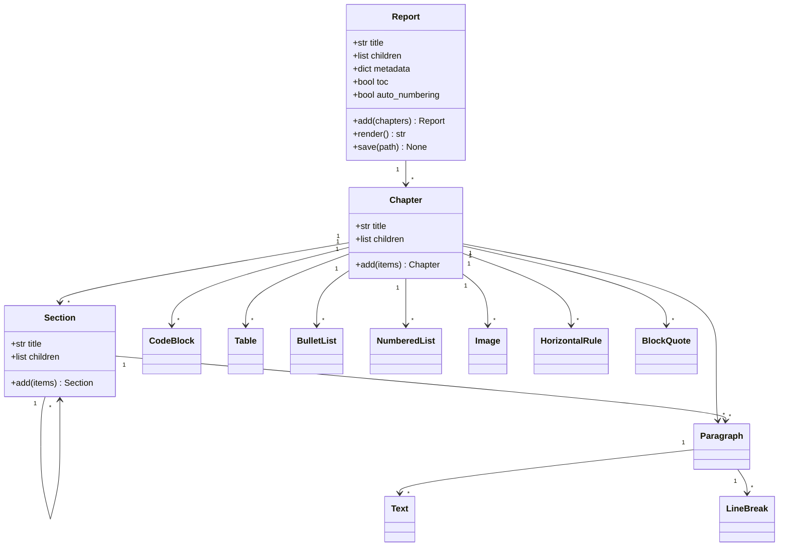
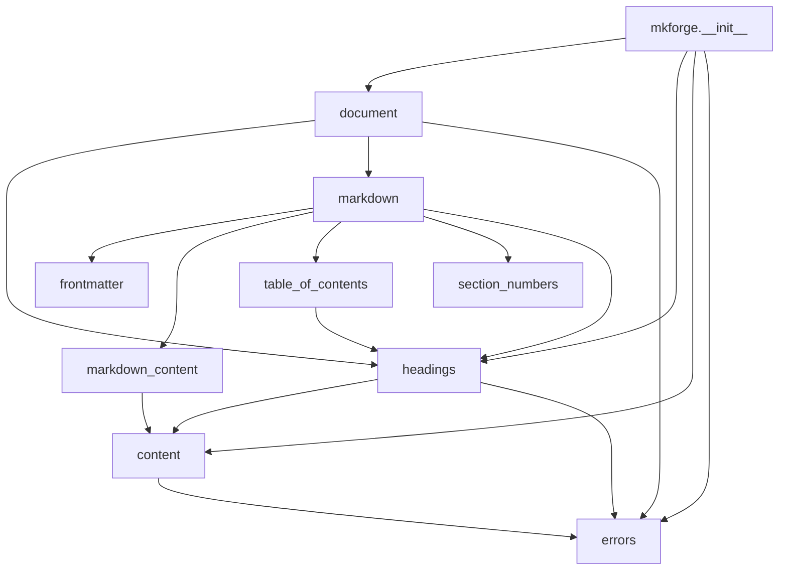
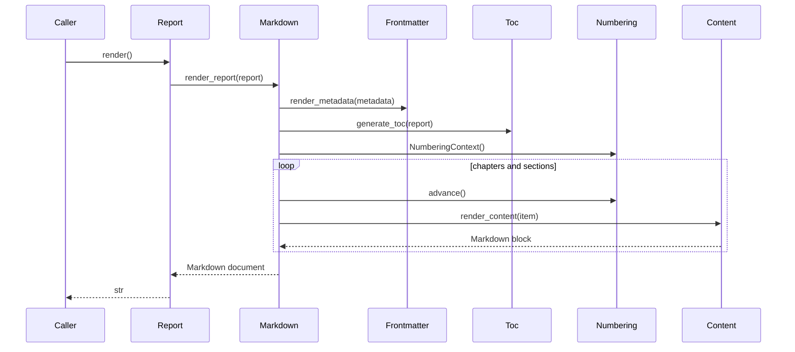
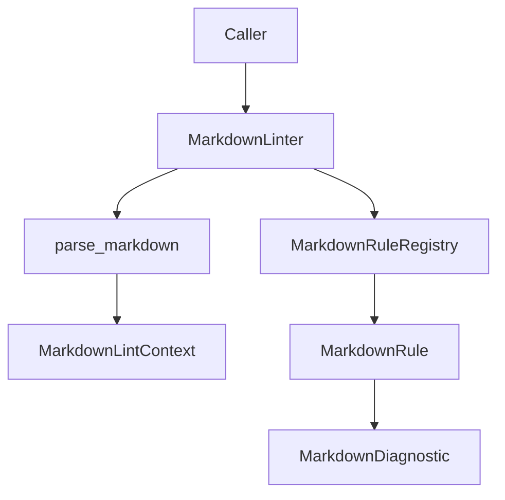
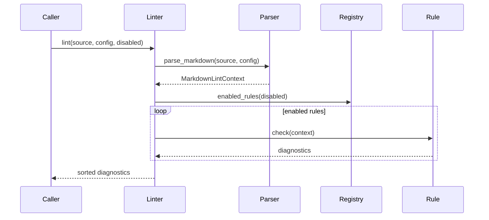
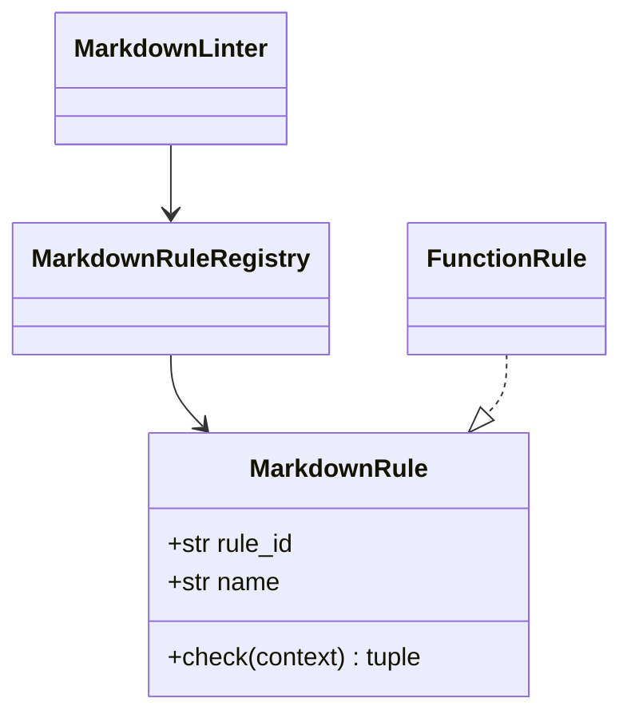

# Software Design Description

## 1. Identification

Document ID: `MKF-SDD-001`

Product: MkForge

Version: 0.1.0

Status: Baseline design description

Related requirements: `docs/SRS.md`

## 2. Purpose

This Software Design Description explains how MkForge satisfies the SRS. It is
written for implementation review, maintenance, audit, and qualification
evidence.

## 3. Design Goals

| ID | Goal |
|---|---|
| DSG-001 | Keep the public API narrow and explicit. |
| DSG-002 | Keep runtime dependencies limited to the standard library. |
| DSG-003 | Separate report data from Markdown rendering. |
| DSG-004 | Validate inputs close to object construction or composition. |
| DSG-005 | Keep Markdown output deterministic. |
| DSG-006 | Keep functions small enough for repository quality gates. |

## 4. Architecture Overview

MkForge uses a layered design:

1. Public package API in `mkforge.__init__`.
2. Data model classes in `document`, `headings`, and `content`.
3. Rendering orchestration in `markdown`.
4. Specialized rendering helpers in `markdown_content`, `frontmatter`,
   `table_of_contents`, and `section_numbers`.
5. Explicit exceptions in `errors`.

No module starts external processes, performs network access, or depends on
third-party runtime libraries.

## 5. Module Responsibilities

| Module | Responsibility | Public Elements |
|---|---|---|
| `mkforge.__init__` | Stable package exports | public API names |
| `mkforge._metadata` | package identity constants | `PROJECT_NAME`, `PROJECT_DESCRIPTION` |
| `mkforge.content` | Markdown content dataclasses and content validation | `Paragraph`, `Text`, `LineBreak`, `CodeBlock`, `Table`, `BulletList`, `NumberedList`, `Image`, `HorizontalRule`, `BlockQuote` |
| `mkforge.document` | report root, render and save entry points | `Report` |
| `mkforge.headings` | chapter and section containers, heading depth calculation | `Chapter`, `Section`, `compute_section_heading_level` |
| `mkforge.markdown` | full document render and save orchestration | `render_report`, `save_report` |
| `mkforge.markdown_content` | content element rendering | `render_content` |
| `mkforge.frontmatter` | metadata dictionary rendering | `render_metadata` |
| `mkforge.table_of_contents` | TOC generation and anchor slugs | `generate_toc`, `anchor_slug` |
| `mkforge.section_numbers` | heading numbering state | `NumberingContext`, `numbered_title` |
| `mkforge.errors` | explicit package exceptions | `InvalidChildError`, `InvalidTableError`, `ReportDepthError` |

## 6. Static Structure



## 7. Module Dependency Diagram



## 8. Runtime Rendering Sequence



## 9. Data Design

### 9.1 Report

`Report` stores the document title, ordered chapters, optional metadata
dictionary, TOC flag, and automatic numbering flag.

Design decisions:

- `Report` is mutable through `add()` to support fluent composition.
- `Report.render()` delegates to `mkforge.markdown.render_report`.
- `Report.save(path)` delegates to `mkforge.markdown.save_report`.
- Metadata remains a free-form dictionary.
- Metadata type, metadata keys, TOC flag, numbering flag, and initial children
  are validated during construction.

### 9.2 Chapter

`Chapter` stores a non-blank title and ordered child items. It renders as H2.

Allowed children:

- `Section`;
- any content element defined in `mkforge.content`.

### 9.3 Section

`Section` stores a non-blank title and ordered child items. It renders as H3
through H6 depending on depth.

Allowed children:

- nested `Section`;
- any content element defined in `mkforge.content`.

### 9.4 Content Elements

Content elements are dataclasses representing Markdown concepts. Most are
frozen because they are value-like and do not need composition methods.

| Class | Stored Data | Validation |
|---|---|---|
| `Text` | `content`, `style` | type hints restrict style |
| `LineBreak` | none | none |
| `Paragraph` | plain string or inline tuple | empty plain string rejected |
| `CodeBlock` | code, language | none |
| `Table` | headers, rows | headers required, row width checked |
| `BulletList` | items | non-empty |
| `NumberedList` | items | non-empty |
| `Image` | path, alt, title | none |
| `HorizontalRule` | none | none |
| `BlockQuote` | content | none |

Runtime validation is intentionally stricter than type hints. Public
constructors reject incorrect runtime types with explicit `TypeError` or
`ValueError` messages before rendering can fail in lower-level code.

## 10. Markdown Heading Design

The report title is the only H1:

```markdown
# Report title
```

Chapters render as H2:

```markdown
## Chapter title
```

Direct sections render as H3:

```markdown
### Section title
```

Nested sections increment heading level until H6. Rendering a section deeper
than H6 raises `ReportDepthError`.

## 11. Rendering Algorithms

### 11.1 Report Rendering

1. Create a list of Markdown blocks.
2. If metadata exists, append rendered frontmatter.
3. Append the H1 report title.
4. If TOC is enabled, append generated TOC when not empty.
5. Traverse chapters in order.
6. Traverse nested sections in order.
7. Render content elements through `markdown_content.render_content`.
8. Join blocks with two newlines.

### 11.2 Frontmatter Rendering

For each metadata dictionary item:

- `list` and `tuple` values render as YAML list blocks;
- `bool` values render lowercase;
- `None` renders as `null`;
- all other values render through `str(value)`.

This is a deliberately small frontmatter renderer, not a complete YAML
serializer.

### 11.3 TOC Rendering

The TOC traverses chapters and sections. Each line uses:

- two spaces per nesting level below chapter;
- Markdown link syntax;
- anchors generated by `anchor_slug`.

`anchor_slug` lowercases, removes punctuation except word characters,
whitespace, and hyphens, trims whitespace, and replaces whitespace with
hyphens.

### 11.4 Automatic Numbering

`NumberingContext` maintains a stack of counters.

- Entering a level appends a zero counter.
- Rendering a heading advances the current counter.
- Leaving a level removes the last counter.
- The prefix joins counters with dots and appends a final dot.

Example:

```text
1.
1.1.
1.1.1.
```

## 12. Error Handling

| Error | Raised By | Condition |
|---|---|---|
| `ValueError` | `Report`, `Chapter`, `Section` | blank title |
| `ValueError` | `Paragraph` | empty plain string |
| `ValueError` | `BulletList`, `NumberedList` | no items |
| `InvalidChildError` | `Report.add`, `Chapter.add`, `Section.add` | unsupported child |
| `InvalidTableError` | `Table` | empty headers or row width mismatch |
| `ReportDepthError` | `compute_section_heading_level` | heading deeper than H6 |
| `TypeError` | `render_content` | renderer receives unknown content type |
| `TypeError` | constructors and render helpers | invalid runtime input type |

## 13. Interface Design

### 13.1 Public Package API

The stable user-facing API is exported by `mkforge.__init__`.

Users should prefer:

```python
from mkforge import Report, Chapter, Section, Paragraph
```

### 13.2 Module-Level API

Advanced users and tests may use:

- `mkforge.markdown.render_report`;
- `mkforge.markdown.save_report`;
- `mkforge.table_of_contents.anchor_slug`;
- `mkforge.table_of_contents.generate_toc`;
- `mkforge.section_numbers.NumberingContext`;
- `mkforge.section_numbers.numbered_title`.

## 14. Security And Safety Considerations

MkForge does not execute generated Markdown or user-provided code snippets.

MkForge does not fetch network resources.

MkForge writes files only when `Report.save()` or `save_report()` is called by
the user.

MkForge does not sanitize Markdown content. This is intentional because the
caller owns report content.

## 15. Performance Considerations

Rendering is linear in the number of report objects and content elements.

The package does not cache output. Callers can cache rendered Markdown if
needed.

## 16. Test And Verification Design

Verification assets:

| Asset | Purpose |
|---|---|
| `tests/test_metadata.py` | package identity |
| `tests/test_report_generation.py` | full rendering behavior |
| `tests/test_helpers.py` | helper and save behavior |
| `tests/test_validation.py` | validation and explicit errors |
| `demo_report.py` | executable integration example |
| `make check` | repository quality gate |

`make check` covers:

- formatting;
- Ruff;
- Flake8;
- docstring policy;
- Mypy;
- complexity and maintainability metrics;
- Bandit;
- dependency audit;
- Pytest with 100% coverage.

## 17. SRS-To-Design Traceability

| Requirement | Design Element |
|---|---|
| SRS-FR-001 | `document.Report` |
| SRS-FR-002 | `document.Report.metadata`, `frontmatter.render_metadata` |
| SRS-FR-003 | `markdown._initial_parts` |
| SRS-FR-004 | `headings.Chapter`, `document.Report.add` |
| SRS-FR-005 | `headings.Section`, `compute_section_heading_level` |
| SRS-FR-006 | `content.Paragraph`, `markdown_content._render_paragraph` |
| SRS-FR-007 | `content.Text`, `content.LineBreak`, `markdown_content._render_text` |
| SRS-FR-008 | `content.CodeBlock`, `markdown_content._render_code_block` |
| SRS-FR-009 | `content.Table`, `markdown_content._render_table` |
| SRS-FR-010 | `content.BulletList`, `content.NumberedList` |
| SRS-FR-011 | `content.Image`, `markdown_content._render_image` |
| SRS-FR-012 | `content.BlockQuote`, `markdown_content._render_quote` |
| SRS-FR-013 | `content.HorizontalRule`, `markdown_content._render_rule` |
| SRS-FR-014 | `table_of_contents.generate_toc`, `markdown._append_toc` |
| SRS-FR-015 | `section_numbers.NumberingContext`, `markdown._heading_title` |
| SRS-FR-016 | `markdown.render_report`, `markdown.save_report` |
| SRS-FR-017 | `table_of_contents.anchor_slug`, `section_numbers.numbered_title` |
| SRS-FR-018 | `validation`, `content_validation`, `table_validation`, constructor checks |

## 18. Known Limitations

| ID | Limitation | Rationale |
|---|---|---|
| LIM-001 | Frontmatter rendering is not a full YAML serializer. | Keeps runtime dependencies at zero. |
| LIM-002 | Duplicate heading anchors are not disambiguated. | Not required for first package scope. |
| LIM-003 | Markdown content is not escaped. | Caller owns Markdown semantics. |
| LIM-004 | Image paths are not checked. | Avoids file system side effects during rendering. |

## 19. Markdown Linter Design

The linter is intentionally separate from report rendering. It accepts Markdown
text, parses lightweight line and heading context, and applies registered rule
objects.

Primary modules:

| Module | Responsibility |
|---|---|
| `markdown_lint_api` | public diagnostic, context, protocol, and function rule contracts |
| `markdown_lint_registry_api` | mutable rule registry contract |
| `markdown_linter` | public linter engine and convenience helpers |
| `markdown_lint_registry` | compact default rule catalog |
| `markdown_lint_parser` | line and fenced-code state parsing |
| `markdown_lint_heading_parser` | ATX heading parsing |
| `markdown_lint_setext_parser` | setext heading parsing |
| `markdown_lint_*_rules` | focused diagnostic rule families |





The extension ICD is deliberately small: any object implementing `rule_id`,
`name`, and `check(context)` can be registered. `FunctionRule` adapts simple
functions to that protocol.


