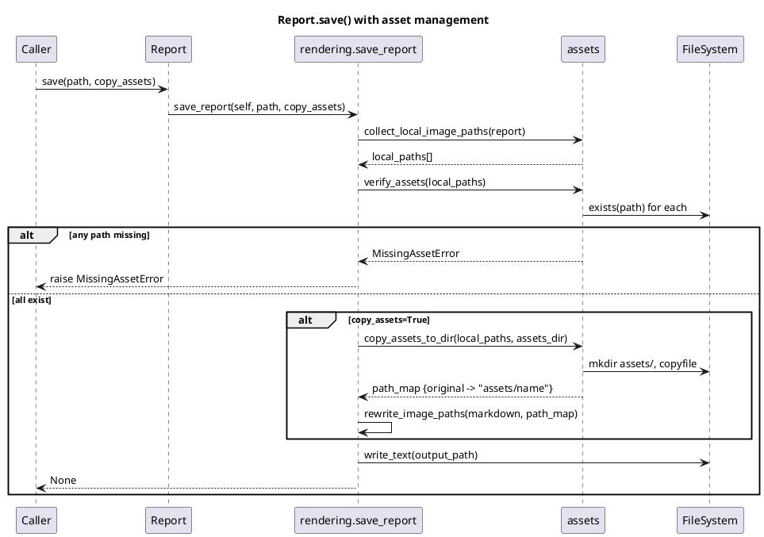

# ADR-001 — Asset management at save time

## Status

Accepted — 2026-06-06

## Context

`Report.save(path)` writes a Markdown file but does not verify that local
image paths referenced in `Image` elements are reachable from the output
location.  This causes silent broken links in the generated document when:

- the image path is absolute and the output is moved;
- the image path is relative to the caller's CWD, not to the output file.

HTTP/HTTPS URLs are intentionally out of scope: MkForge does not make network
calls.

## Decision

`Report.save(path, copy_assets=False)` gains an optional `copy_assets` flag.

### Path classification

A path is **local** if it does not start with `http://` or `https://`.
Local paths are resolved relative to the caller's current working directory
at `save()` time.  HTTP/HTTPS paths are classified as **remote** and are
neither verified nor copied.

### Validation (always, regardless of `copy_assets`)

Before writing the output file, `save()` collects every local image path in
the report tree and checks that each resolved path exists on disk.  If any
path does not exist, a `MissingAssetError` is raised with the list of missing
paths.  No output file is written.

### Copy mode (`copy_assets=True`)

When `copy_assets=True`:

1. An `assets/` directory is created next to the output file.
2. Each unique local image is copied into `assets/`.
3. **Collision handling**: if two source images share the same filename but
   come from different directories, the second (and subsequent) copies are
   renamed by appending a one-based counter suffix before the extension:
   `chart.png` → `chart_1.png`, `chart_2.png`, etc.  A `warnings.warn()`
   is emitted for each renamed file.
4. The `Image.path` references in the rendered Markdown are rewritten to
   point to the new `assets/<filename>` relative paths.

When `copy_assets=False` (default), the Markdown is written with the original
paths unchanged.  The existence check still runs.

### `render()` is unaffected

`Report.render()` never touches the filesystem.  It always uses original paths.
Path rewriting is a save-only concern.

## Public API changes

```python
# document.py
class Report:
    def save(
        self,
        path: str | Path,
        copy_assets: bool = False,
    ) -> None: ...

# rendering.py
def save_report(
    report: object,
    path: str | Path,
    copy_assets: bool = False,
) -> None: ...
```

New exception in `errors.py`:

```python
class MissingAssetError(ValueError):
    """Raised when one or more local image paths cannot be found at save time."""
```

New internal module `src/mkforge/assets.py` owns:

- `collect_local_image_paths(report) -> list[Path]` — tree walk
- `verify_assets(paths) -> None` — raises `MissingAssetError` if any missing
- `copy_assets_to_dir(paths, assets_dir) -> dict[Path, str]` — copy + rename,
  returns mapping from original resolved path to new relative `assets/<name>`
- `rewrite_image_paths(markdown, path_map) -> str` — string substitution

## Design patterns

| Pattern | Where | Reason |
|---------|-------|--------|
| Separation of concerns | `assets.py` isolated from `rendering.py` | Asset management has a different reason to change than Markdown rendering |
| Fail-fast validation | `verify_assets` before any write | Prevents partial output |
| Explicit opt-in | `copy_assets=False` default | Preserves current behaviour; no surprise side-effects |

## Consequences

- `MissingAssetError` is added to the public API and exported from `mkforge`.
- `save_report` gains a `copy_assets` parameter — backwards-compatible (default
  `False`).
- `assets.py` is a new module below 100 lines with a single responsibility.
- HTTP/HTTPS paths are explicitly excluded from verification; callers who need
  URL reachability checks must do so themselves.

## PlantUML — save() flow


